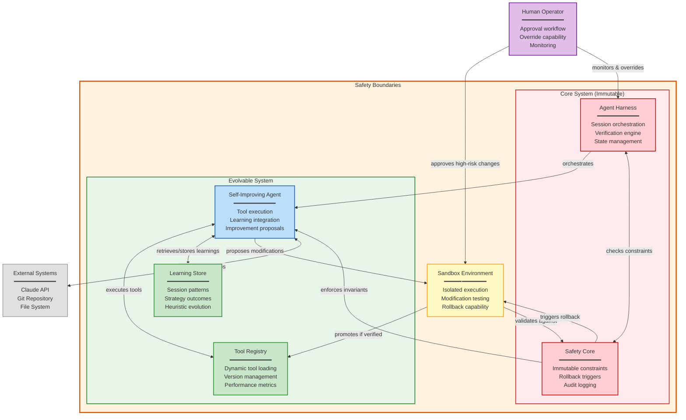

# Architecture Enhancement Progress Checkpoint

## Status: Complete

## Date: 2025-12-27

## Background Agents Completed

| Agent ID | Task | Status | Output |
|----------|------|--------|--------|
| ac3375d | Main system architecture design | Complete | ENHANCED_ARCHITECTURE_V2.md |
| a79f187 | Backend subsystems (contracts, context, routing) | Complete | BACKEND_SUBSYSTEMS.md |
| a8c4b90 | Multi-agent orchestration layer | Complete | MULTI_AGENT_ORCHESTRATION.md |
| a1cc42d | Self-improvement capabilities (SICA) | Complete | C4 Context Diagram (in this file) |

## Design Documents Created

1. **ENHANCED_ARCHITECTURE_V2.md** - Master architecture document
   - 6-layer architecture design
   - OrchestratorMode enum for different execution modes
   - 7-phase migration strategy
   - Configuration schema
   - Risk assessment

2. **MULTI_AGENT_ORCHESTRATION.md** - Multi-agent system design
   - Agent role registry
   - Producer-Critic loop
   - Hierarchical decomposition
   - Inter-agent communication
   - Overseer architecture

3. **BACKEND_SUBSYSTEMS.md** - Backend subsystems design
   - Contract Management System
   - Context Staging System
   - Multi-Attempt Execution Engine
   - Agent Routing System

## Self-Improving Agent System - C4 Context Diagram

### SICA Component Explanation

- **Self-Improving Agent**: Central component that executes tasks, integrates learnings, and proposes improvements
- **Agent Harness**: Existing orchestration system (immutable) managing sessions, verification, and state
- **Safety Core**: Immutable safety constraints, audit logging, and automatic rollback triggers
- **Tool Registry**: Dynamic registry for loading, versioning, and tracking tool performance metrics
- **Learning Store**: Persistent storage for session patterns, successful strategies, and evolved heuristics
- **Sandbox Environment**: Isolated testing environment where modifications are validated before promotion
- **Safety Boundaries**: Outer constraint layer ensuring all components operate within defined limits
- **Human Operator**: External oversight for approving high-risk changes and emergency intervention

### Key Safety Principles

- The Agent can only modify components in the **Evolvable System** (green)
- The **Core System** (red) remains immutable and controls the Agent
- All modifications flow through the **Sandbox** before reaching production
- The **Safety Core** enforces invariants and can trigger rollbacks
- **Human approval** is required for certain high-risk modifications

## Key Requirements Extracted from Brief

### 1. The Contractor Model (Formalized Autonomy)
- **Formalized Contracts**: Detailed specifications serving as single source of truth
- **Context Staging Area**: Dedicated `task-context/` workspace with curated codebase, API definitions, style guides
- **Quality-Focused Iterative Execution**: Multiple approaches, compile, test, score on security/readability
- **Hierarchical Decomposition**: Project Manager agent breaks master contract into subcontracts

### 2. Self-Improving Architecture (SICA & AlphaEvolve)
- Agent modifies its own source code/tools to improve
- "Smart Editor" with AST Symbol Locator for code navigation
- **Overseer Role**: Async LLM monitors coding agent for loops, stagnation, inefficient patterns
- Evolution from basic file overwrites to sophisticated AST-based editing

### 3. Producer-Critic (Generator-Reviewer) Model
- Separate creation from evaluation to mitigate "cognitive bias"
- **Producer (Peer Programmer)**: Generates initial code draft
- **Critic (Code Reviewer)**: Principal Engineer persona, structured feedback
- Loop until "CODE_IS_PERFECT" or stop condition

### 4. Essential Agent Roles & Specialization
| Role | Responsibility | Interaction Pattern |
|------|---------------|---------------------|
| Architect | Human defining high-level "what" and "why" | Human-in-the-Loop |
| Project Manager | Decomposes goals into sub-tasks, manages dependencies | Hierarchical Planning |
| Scaffolder | Writes new code from detailed specs | Tool Use (File I/O) |
| Test Engineer | Writes comprehensive tests | Verification |
| Reviewer | Principal Engineer, critiques changes | Reflection |
| Overseer | Monitors *behavior* of other agents | Safety/Monitoring |

### 5. Key Design Patterns
- **Prompt Chaining**: Pseudocode → Draft → Static Analysis → Refinement → Documentation
- **Routing**: Assess complexity, route to appropriate model (cheap vs expensive)
- **Sandboxed Execution**: Code Interpreter or safe CLI for validation
- **RAG/Vector Search**: Query existing codebase for patterns

## Current System Analysis (from Research Agent)

### Existing Architecture Summary
- **SessionOrchestrator** (session.py): Central hub, 14-step lifecycle
- **AgentRunner** (agent.py): Claude API conversations with tool use
- **Feature Management** (features.py): features.json with dependencies
- **Tool System**: Schemas, definitions, executor with handlers
- **Verification Engine**: Independent test/lint verification with baseline
- **Checkpoint System**: Git-based rollback
- Single feature per session, async-first design

### Key Existing Patterns
- Dataclass pattern for all data structures
- Factory pattern for agent/handler creation
- Strategy pattern for prompt type selection
- Observer pattern for progress callbacks
- State machine for session state
- Repository pattern for load/save operations

### Identified Gaps (Addressed in New Design)

1. **No Multi-Agent Support** → See MULTI_AGENT_ORCHESTRATION.md
2. **No Producer-Critic Separation** → See MULTI_AGENT_ORCHESTRATION.md (Producer-Critic Loop)
3. **No Hierarchical Decomposition** → See BACKEND_SUBSYSTEMS.md (Contract Management)
4. **No Context Staging** → See BACKEND_SUBSYSTEMS.md (Context Staging System)
5. **No Model Routing** → See BACKEND_SUBSYSTEMS.md (Agent Routing System)
6. **No Self-Improvement** → See SICA diagram above
7. **No Overseer** → See MULTI_AGENT_ORCHESTRATION.md (Overseer Architecture)
8. **Limited AST Support** → See ENHANCED_ARCHITECTURE_V2.md (Smart Editor)
