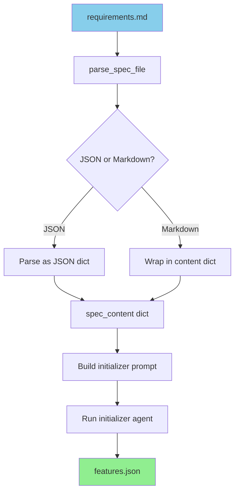
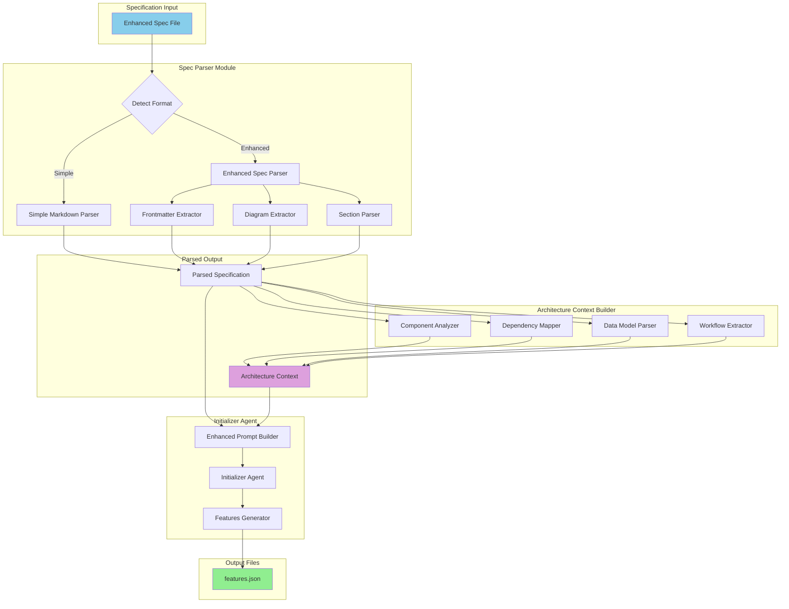
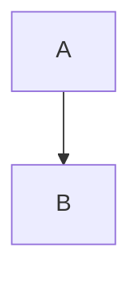
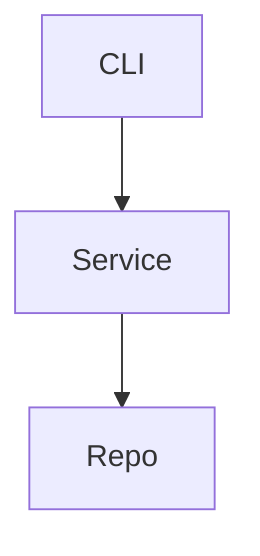
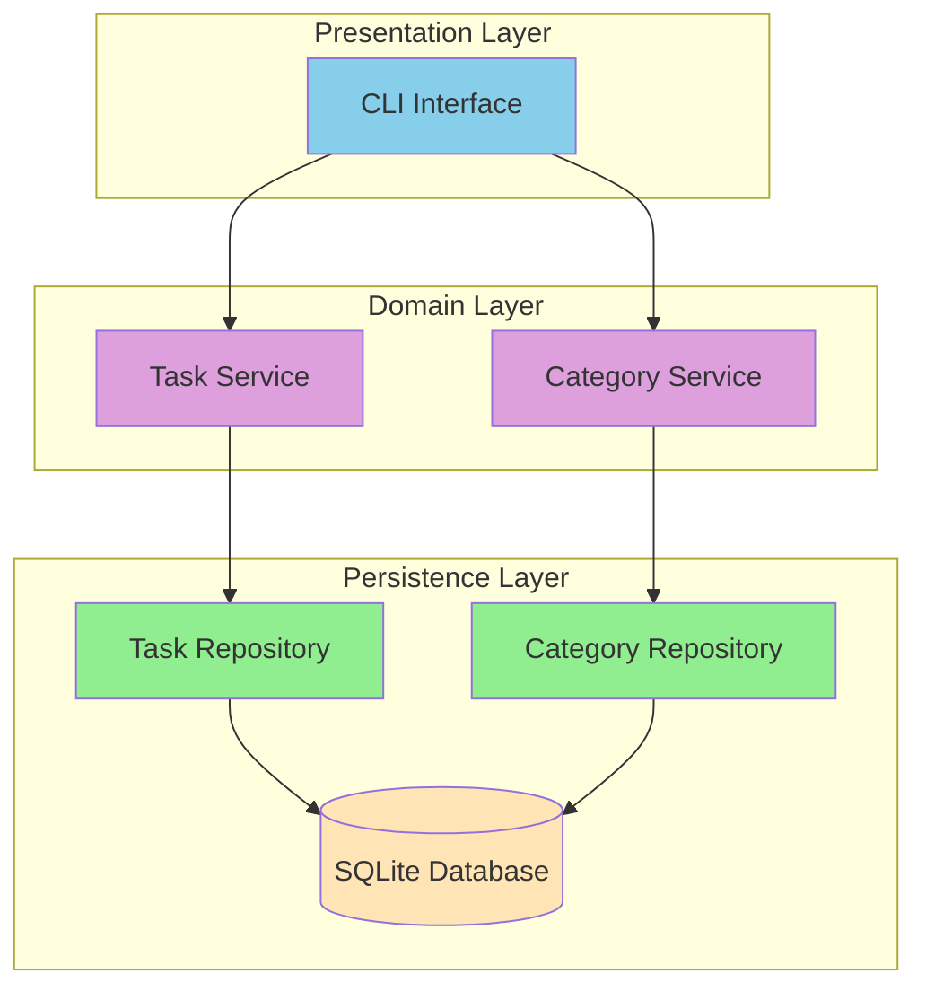
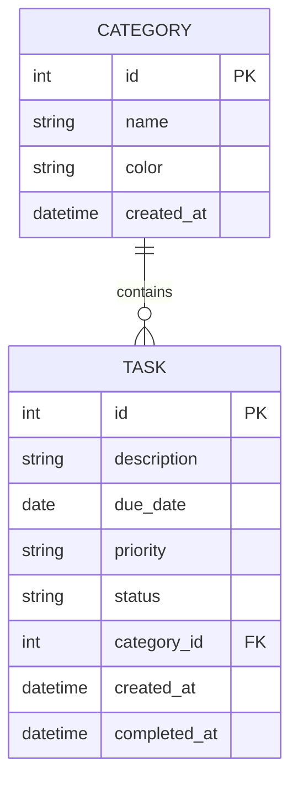
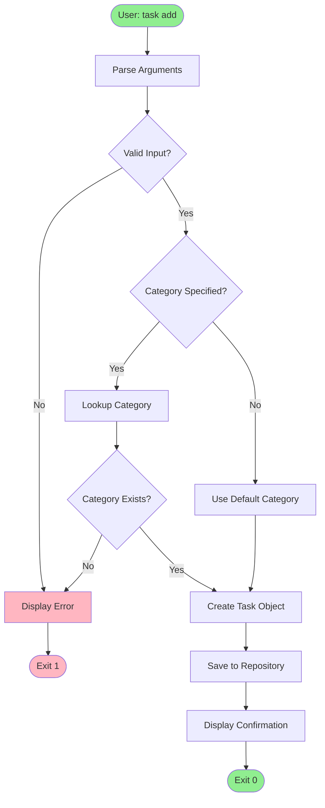
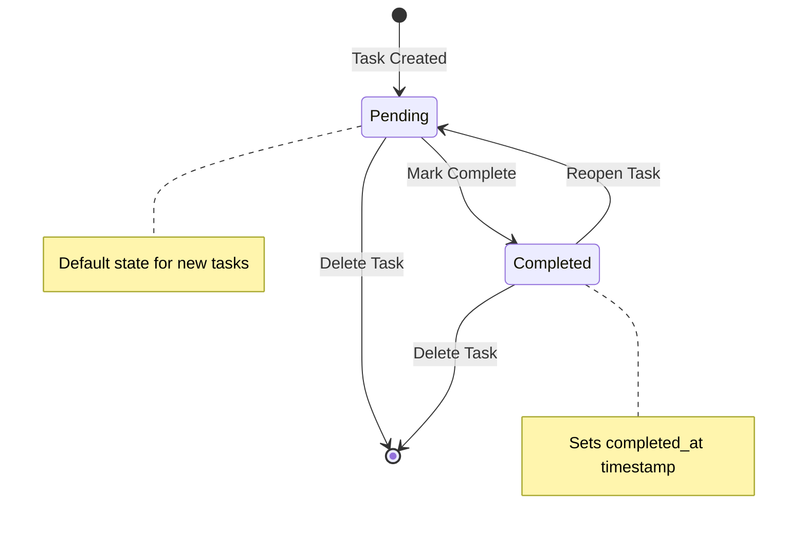

# Enhanced Specification System Design

## Version 1.0.0

**Status:** Proposed
**Author:** Prototype Designer
**Date:** 2025-12-26

---

## 1. Overview

### 1.1 Purpose

Enhance the Universal Agent Harness specification system to accept richer project descriptions including system designs, architecture diagrams, and component specifications. This enables the initializer agent to generate more accurate feature breakdowns with proper dependencies, understand component boundaries, and create test file structures that reflect the intended architecture.

### 1.2 Goals

1. Accept enhanced markdown specifications with embedded Mermaid diagrams
2. Parse architectural context from system design descriptions
3. Provide component-aware feature generation
4. Maintain backwards compatibility with simple `requirements.md` files
5. Keep the single-machine, single-file approach (no external diagram services)

### 1.3 Non-Goals

- Image file parsing (OCR/vision for diagram images)
- Interactive diagram editors
- Distributed specification storage
- Real-time collaborative editing

---

## 2. Current State Analysis

### 2.1 Current Specification Format

The harness currently accepts a simple markdown file via `harness init --spec`:

```markdown
# Task Manager CLI

Build a command-line task manager application with the following features:

## Core Features
1. Add new tasks with a description and optional due date
2. List all tasks with status (pending/completed)
3. Mark tasks as complete
4. Delete tasks

## Technical Requirements
- Use Python 3.11+
- Store tasks in a JSON file
- Include comprehensive tests
- Follow PEP 8 style guidelines
```

### 2.2 Current Parsing Flow



### 2.3 Limitations

1. **No architectural context** - Agent cannot infer component boundaries
2. **Flat feature list** - Dependencies must be guessed from descriptions
3. **No data model awareness** - Test files are not organized by domain
4. **No component mapping** - Cannot group features by architectural layer

---

## 3. Enhanced Specification Format

### 3.1 Format Decision

**Recommendation: Extended Markdown with Structured Sections**

Rationale:
- Markdown is human-readable and widely understood
- Mermaid diagrams render in GitHub, VS Code, and most documentation tools
- YAML frontmatter provides structured metadata without breaking markdown
- Single file keeps specification portable and version-controllable

### 3.2 Specification Schema

```markdown
---
# YAML Frontmatter (optional)
project:
  name: "Project Name"
  type: "cli|web|api|library"
  language: "python"

architecture:
  style: "monolith|layered|hexagonal"
  persistence: "sqlite|json|memory"

init_mode: "new|adopt"
---

# Project Title

Brief project description (1-3 paragraphs).

## System Overview

High-level description of what the system does and its major responsibilities.

## Architecture

### Component Diagram

` ` `mermaid
flowchart TD
    subgraph Presentation
        CLI[CLI Interface]
        API[REST API]
    end
    subgraph Domain
        TaskService[Task Service]
        UserService[User Service]
    end
    subgraph Persistence
        TaskRepo[Task Repository]
        UserRepo[User Repository]
        DB[(SQLite)]
    end
    CLI --> TaskService
    API --> TaskService
    TaskService --> TaskRepo
    TaskRepo --> DB
` ` `

### Components

#### Component: CLI Interface
- **Responsibility**: Handle user input and display output
- **Dependencies**: Task Service
- **Test Strategy**: Integration tests with mock service

#### Component: Task Service
- **Responsibility**: Business logic for task operations
- **Dependencies**: Task Repository
- **Test Strategy**: Unit tests with mock repository

#### Component: Task Repository
- **Responsibility**: Data access layer
- **Dependencies**: SQLite database
- **Test Strategy**: Integration tests with test database

## Data Model

### Entity Relationship Diagram

` ` `mermaid
erDiagram
    USER {
        int id PK
        string name
        string email
        datetime created_at
    }
    TASK {
        int id PK
        string description
        date due_date
        string status
        int user_id FK
    }
    USER ||--o{ TASK : owns
` ` `

### Entities

#### Entity: Task
- **Fields**: id, description, due_date, status, user_id
- **Validation**: description required, status in [pending, completed]
- **Test File**: tests/test_task_model.py

## Features

### Core Features
1. Add new tasks with a description and optional due date
2. List all tasks with status (pending/completed)
3. Mark tasks as complete
4. Delete tasks

### Additional Features
5. Filter tasks by status
6. Sort tasks by due date

## Technical Requirements

- Python 3.11+
- SQLite for persistence
- Click for CLI framework
- Pytest for testing

## Workflows

### Task Creation Flow

` ` `mermaid
flowchart TD
    Start([User runs add command]) --> Parse[Parse CLI arguments]
    Parse --> Validate{Valid input?}
    Validate -->|No| Error[Show error message]
    Validate -->|Yes| Create[Create Task object]
    Create --> Save[Save to repository]
    Save --> Confirm[Display confirmation]
    Confirm --> End([Command complete])
    Error --> End

    style Start fill:#90EE90
    style End fill:#87CEEB
    style Error fill:#FFB6C1
` ` `
```

### 3.3 Section Definitions

| Section | Required | Purpose |
|---------|----------|---------|
| YAML Frontmatter | No | Structured project metadata |
| Project Title | Yes | H1 heading with project name |
| System Overview | No | High-level description |
| Architecture | No | Component diagram and descriptions |
| Data Model | No | ER diagrams and entity definitions |
| Features | Yes | Numbered feature list (existing format) |
| Technical Requirements | No | Technology constraints |
| Workflows | No | Process flow diagrams |

---

## 4. Architecture

### 4.1 Component Diagram



### 4.2 Module Structure

```
src/agent_harness/
├── spec/                        # NEW: Specification parsing module
│   ├── __init__.py
│   ├── parser.py               # Main parser orchestration
│   ├── format_detector.py      # Detect simple vs enhanced format
│   ├── frontmatter.py          # YAML frontmatter extraction
│   ├── diagram_extractor.py    # Mermaid diagram extraction
│   ├── section_parser.py       # Section-aware markdown parsing
│   └── context_builder.py      # Architecture context generation
├── prompts/
│   └── initializer.py          # MODIFIED: Enhanced prompts
└── init.py                     # MODIFIED: Use new parser
```

---

## 5. Core Components

### 5.1 Format Detector

Determines whether a specification is simple or enhanced.

```python
# spec/format_detector.py

from dataclasses import dataclass
from enum import Enum


class SpecFormat(Enum):
    SIMPLE_MARKDOWN = "simple"
    ENHANCED_MARKDOWN = "enhanced"
    JSON = "json"


@dataclass
class FormatDetection:
    format: SpecFormat
    has_frontmatter: bool
    has_diagrams: bool
    has_architecture_section: bool
    has_data_model_section: bool


def detect_spec_format(content: str, file_extension: str) -> FormatDetection:
    """
    Detect specification format from content and extension.

    Enhanced format indicators:
    - YAML frontmatter (--- at start)
    - Mermaid code blocks
    - ## Architecture section
    - ## Data Model section

    Returns FormatDetection with format type and feature flags.
    """
    if file_extension == ".json":
        return FormatDetection(
            format=SpecFormat.JSON,
            has_frontmatter=False,
            has_diagrams=False,
            has_architecture_section=False,
            has_data_model_section=False,
        )

    has_frontmatter = content.strip().startswith("---")
    has_diagrams = "```mermaid" in content
    has_architecture = "## Architecture" in content or "## System Design" in content
    has_data_model = "## Data Model" in content or "## Entities" in content

    is_enhanced = any([
        has_frontmatter,
        has_diagrams,
        has_architecture,
        has_data_model,
    ])

    return FormatDetection(
        format=SpecFormat.ENHANCED_MARKDOWN if is_enhanced else SpecFormat.SIMPLE_MARKDOWN,
        has_frontmatter=has_frontmatter,
        has_diagrams=has_diagrams,
        has_architecture_section=has_architecture,
        has_data_model_section=has_data_model,
    )
```

### 5.2 Frontmatter Extractor

Parses YAML frontmatter if present.

```python
# spec/frontmatter.py

import re
from dataclasses import dataclass, field
from typing import Any, Optional

import yaml


@dataclass
class ProjectMetadata:
    name: Optional[str] = None
    project_type: Optional[str] = None  # cli, web, api, library
    language: str = "python"


@dataclass
class ArchitectureMetadata:
    style: Optional[str] = None  # monolith, layered, hexagonal
    persistence: Optional[str] = None  # sqlite, json, memory


@dataclass
class Frontmatter:
    project: ProjectMetadata = field(default_factory=ProjectMetadata)
    architecture: ArchitectureMetadata = field(default_factory=ArchitectureMetadata)
    init_mode: str = "new"
    raw: dict[str, Any] = field(default_factory=dict)


FRONTMATTER_PATTERN = re.compile(r"^---\s*\n(.*?)\n---\s*\n", re.DOTALL)


def extract_frontmatter(content: str) -> tuple[Frontmatter, str]:
    """
    Extract YAML frontmatter from markdown content.

    Returns:
        Tuple of (Frontmatter object, remaining content without frontmatter)
    """
    match = FRONTMATTER_PATTERN.match(content)

    if not match:
        return Frontmatter(), content

    try:
        raw_yaml = yaml.safe_load(match.group(1))
        if not isinstance(raw_yaml, dict):
            raw_yaml = {}
    except yaml.YAMLError:
        return Frontmatter(), content

    remaining_content = content[match.end():]

    # Parse project metadata
    project_data = raw_yaml.get("project", {})
    project = ProjectMetadata(
        name=project_data.get("name"),
        project_type=project_data.get("type"),
        language=project_data.get("language", "python"),
    )

    # Parse architecture metadata
    arch_data = raw_yaml.get("architecture", {})
    architecture = ArchitectureMetadata(
        style=arch_data.get("style"),
        persistence=arch_data.get("persistence"),
    )

    return Frontmatter(
        project=project,
        architecture=architecture,
        init_mode=raw_yaml.get("init_mode", "new"),
        raw=raw_yaml,
    ), remaining_content
```

### 5.3 Diagram Extractor

Extracts Mermaid diagrams and classifies them by type.

```python
# spec/diagram_extractor.py

import re
from dataclasses import dataclass
from enum import Enum
from typing import Optional


class DiagramType(Enum):
    FLOWCHART = "flowchart"
    COMPONENT = "component"
    SEQUENCE = "sequence"
    ER = "er"
    STATE = "state"
    CLASS = "class"
    UNKNOWN = "unknown"


@dataclass
class ExtractedDiagram:
    diagram_type: DiagramType
    content: str
    context_heading: Optional[str]  # The heading this diagram appears under
    position: int  # Character position in document


MERMAID_BLOCK_PATTERN = re.compile(
    r"```mermaid\s*\n(.*?)```",
    re.DOTALL
)

HEADING_PATTERN = re.compile(r"^(#{1,6})\s+(.+)$", re.MULTILINE)


def classify_diagram(content: str) -> DiagramType:
    """Classify a Mermaid diagram by its type declaration."""
    first_line = content.strip().split("\n")[0].lower()

    if first_line.startswith("flowchart") or first_line.startswith("graph"):
        # Check if it looks like a component diagram
        if "subgraph" in content.lower():
            return DiagramType.COMPONENT
        return DiagramType.FLOWCHART
    elif first_line.startswith("erdiagram"):
        return DiagramType.ER
    elif first_line.startswith("sequencediagram"):
        return DiagramType.SEQUENCE
    elif first_line.startswith("statediagram"):
        return DiagramType.STATE
    elif first_line.startswith("classdiagram"):
        return DiagramType.CLASS

    return DiagramType.UNKNOWN


def find_context_heading(content: str, position: int) -> Optional[str]:
    """Find the nearest heading before a given position."""
    headings = list(HEADING_PATTERN.finditer(content))

    for heading in reversed(headings):
        if heading.start() < position:
            return heading.group(2).strip()

    return None


def extract_diagrams(content: str) -> list[ExtractedDiagram]:
    """
    Extract all Mermaid diagrams from markdown content.

    Returns list of ExtractedDiagram with type, content, and context.
    """
    diagrams = []

    for match in MERMAID_BLOCK_PATTERN.finditer(content):
        diagram_content = match.group(1).strip()
        diagram_type = classify_diagram(diagram_content)
        context_heading = find_context_heading(content, match.start())

        diagrams.append(ExtractedDiagram(
            diagram_type=diagram_type,
            content=diagram_content,
            context_heading=context_heading,
            position=match.start(),
        ))

    return diagrams
```

### 5.4 Section Parser

Parses structured sections from markdown.

```python
# spec/section_parser.py

import re
from dataclasses import dataclass, field
from typing import Optional


@dataclass
class ComponentDefinition:
    name: str
    responsibility: Optional[str] = None
    dependencies: list[str] = field(default_factory=list)
    test_strategy: Optional[str] = None


@dataclass
class EntityDefinition:
    name: str
    fields: list[str] = field(default_factory=list)
    validation: Optional[str] = None
    test_file: Optional[str] = None


@dataclass
class FeatureDefinition:
    number: int
    description: str
    category: str = "core"


@dataclass
class ParsedSections:
    title: str
    overview: Optional[str] = None
    components: list[ComponentDefinition] = field(default_factory=list)
    entities: list[EntityDefinition] = field(default_factory=list)
    features: list[FeatureDefinition] = field(default_factory=list)
    technical_requirements: list[str] = field(default_factory=list)
    raw_sections: dict[str, str] = field(default_factory=dict)


SECTION_PATTERN = re.compile(r"^(#{1,3})\s+(.+)$", re.MULTILINE)
COMPONENT_PATTERN = re.compile(
    r"#{3,4}\s+Component:\s*(.+?)(?=\n#{3,4}|\n##|\Z)",
    re.DOTALL
)
ENTITY_PATTERN = re.compile(
    r"#{3,4}\s+Entity:\s*(.+?)(?=\n#{3,4}|\n##|\Z)",
    re.DOTALL
)
FEATURE_LIST_PATTERN = re.compile(r"^\d+\.\s+(.+)$", re.MULTILINE)


def parse_component(text: str) -> ComponentDefinition:
    """Parse a component definition block."""
    lines = text.strip().split("\n")
    name = lines[0].strip()

    component = ComponentDefinition(name=name)

    for line in lines[1:]:
        line = line.strip()
        if line.startswith("- **Responsibility**:"):
            component.responsibility = line.split(":", 1)[1].strip()
        elif line.startswith("- **Dependencies**:"):
            deps = line.split(":", 1)[1].strip()
            component.dependencies = [d.strip() for d in deps.split(",")]
        elif line.startswith("- **Test Strategy**:"):
            component.test_strategy = line.split(":", 1)[1].strip()

    return component


def parse_entity(text: str) -> EntityDefinition:
    """Parse an entity definition block."""
    lines = text.strip().split("\n")
    name = lines[0].strip()

    entity = EntityDefinition(name=name)

    for line in lines[1:]:
        line = line.strip()
        if line.startswith("- **Fields**:"):
            fields = line.split(":", 1)[1].strip()
            entity.fields = [f.strip() for f in fields.split(",")]
        elif line.startswith("- **Validation**:"):
            entity.validation = line.split(":", 1)[1].strip()
        elif line.startswith("- **Test File**:"):
            entity.test_file = line.split(":", 1)[1].strip()

    return entity


def extract_sections(content: str) -> dict[str, str]:
    """Extract raw section content by heading."""
    sections = {}
    matches = list(SECTION_PATTERN.finditer(content))

    for i, match in enumerate(matches):
        heading = match.group(2).strip()
        start = match.end()
        end = matches[i + 1].start() if i + 1 < len(matches) else len(content)
        sections[heading] = content[start:end].strip()

    return sections


def parse_features(content: str) -> list[FeatureDefinition]:
    """Extract numbered features from content."""
    features = []

    # Find the features section
    sections = extract_sections(content)
    feature_content = ""

    for heading, section_content in sections.items():
        if "feature" in heading.lower():
            feature_content += section_content + "\n"

    if not feature_content:
        feature_content = content

    # Determine category from section heading
    current_category = "core"

    for match in FEATURE_LIST_PATTERN.finditer(feature_content):
        features.append(FeatureDefinition(
            number=len(features) + 1,
            description=match.group(1).strip(),
            category=current_category,
        ))

    return features


def parse_sections(content: str) -> ParsedSections:
    """
    Parse all structured sections from markdown content.

    Returns ParsedSections with extracted components, entities, features.
    """
    # Extract title (first H1)
    title_match = re.search(r"^#\s+(.+)$", content, re.MULTILINE)
    title = title_match.group(1).strip() if title_match else "Untitled Project"

    raw_sections = extract_sections(content)

    # Parse components
    components = []
    for match in COMPONENT_PATTERN.finditer(content):
        components.append(parse_component(match.group(1)))

    # Parse entities
    entities = []
    for match in ENTITY_PATTERN.finditer(content):
        entities.append(parse_entity(match.group(1)))

    # Parse features
    features = parse_features(content)

    # Extract technical requirements
    tech_reqs = []
    for heading, section_content in raw_sections.items():
        if "technical" in heading.lower() and "requirement" in heading.lower():
            for line in section_content.split("\n"):
                line = line.strip()
                if line.startswith("- "):
                    tech_reqs.append(line[2:])

    # Extract overview
    overview = raw_sections.get("System Overview") or raw_sections.get("Overview")

    return ParsedSections(
        title=title,
        overview=overview,
        components=components,
        entities=entities,
        features=features,
        technical_requirements=tech_reqs,
        raw_sections=raw_sections,
    )
```

### 5.5 Architecture Context Builder

Builds architectural context for the initializer agent.

```python
# spec/context_builder.py

from dataclasses import dataclass, field
from typing import Optional

from agent_harness.spec.diagram_extractor import DiagramType, ExtractedDiagram
from agent_harness.spec.frontmatter import Frontmatter
from agent_harness.spec.section_parser import (
    ComponentDefinition,
    EntityDefinition,
    ParsedSections,
)


@dataclass
class ComponentContext:
    name: str
    layer: str  # presentation, domain, persistence, infrastructure
    dependencies: list[str]
    suggested_test_file: str


@dataclass
class EntityContext:
    name: str
    suggested_test_file: str
    related_components: list[str]


@dataclass
class FeatureContext:
    description: str
    suggested_components: list[str]
    suggested_dependencies: list[int]  # Other feature IDs
    suggested_test_file: str
    size_estimate: str  # small, medium, large


@dataclass
class ArchitectureContext:
    project_name: str
    project_type: str
    architecture_style: str

    components: list[ComponentContext] = field(default_factory=list)
    entities: list[EntityContext] = field(default_factory=list)
    features: list[FeatureContext] = field(default_factory=list)

    component_diagram: Optional[str] = None
    er_diagram: Optional[str] = None
    workflow_diagrams: list[str] = field(default_factory=list)

    layer_order: list[str] = field(default_factory=lambda: [
        "persistence", "domain", "presentation", "infrastructure"
    ])


def infer_layer(component: ComponentDefinition) -> str:
    """Infer architectural layer from component name and description."""
    name_lower = component.name.lower()
    resp_lower = (component.responsibility or "").lower()

    if any(k in name_lower for k in ["repo", "database", "storage", "persistence"]):
        return "persistence"
    if any(k in name_lower for k in ["service", "manager", "handler", "domain"]):
        return "domain"
    if any(k in name_lower for k in ["cli", "api", "ui", "controller", "view"]):
        return "presentation"
    if any(k in name_lower for k in ["config", "util", "helper", "infra"]):
        return "infrastructure"

    # Check responsibility
    if any(k in resp_lower for k in ["data access", "persist", "database"]):
        return "persistence"
    if any(k in resp_lower for k in ["business logic", "domain", "service"]):
        return "domain"
    if any(k in resp_lower for k in ["user input", "display", "http", "rest"]):
        return "presentation"

    return "domain"  # Default


def generate_test_file(name: str, layer: str, language: str = "python") -> str:
    """Generate suggested test file path."""
    snake_name = name.lower().replace(" ", "_").replace("-", "_")

    if language == "python":
        return f"tests/test_{snake_name}.py"
    elif language in ("javascript", "typescript"):
        return f"tests/{snake_name}.test.ts"
    else:
        return f"tests/test_{snake_name}"


def estimate_feature_size(description: str) -> str:
    """Estimate feature size from description."""
    desc_lower = description.lower()

    # Large indicators
    if any(k in desc_lower for k in [
        "integrate", "migration", "authentication", "authorization",
        "api", "database schema", "full", "complete"
    ]):
        return "large"

    # Small indicators
    if any(k in desc_lower for k in [
        "add", "remove", "update", "fix", "rename", "simple",
        "display", "show", "list", "delete"
    ]):
        return "small"

    return "medium"


def build_architecture_context(
    frontmatter: Frontmatter,
    sections: ParsedSections,
    diagrams: list[ExtractedDiagram],
) -> ArchitectureContext:
    """
    Build comprehensive architecture context from parsed specification.

    This context is used to generate more accurate features.json with:
    - Proper component-based test file organization
    - Dependency inference from architectural layers
    - Size estimates based on component complexity
    """
    project_name = frontmatter.project.name or sections.title
    project_type = frontmatter.project.project_type or "cli"
    arch_style = frontmatter.architecture.style or "layered"
    language = frontmatter.project.language

    # Build component contexts
    components = []
    for comp in sections.components:
        layer = infer_layer(comp)
        components.append(ComponentContext(
            name=comp.name,
            layer=layer,
            dependencies=comp.dependencies,
            suggested_test_file=generate_test_file(comp.name, layer, language),
        ))

    # Build entity contexts
    entities = []
    for entity in sections.entities:
        related = []
        for comp in sections.components:
            if entity.name.lower() in comp.name.lower():
                related.append(comp.name)

        entities.append(EntityContext(
            name=entity.name,
            suggested_test_file=entity.test_file or generate_test_file(
                entity.name, "domain", language
            ),
            related_components=related,
        ))

    # Build feature contexts with dependency inference
    features = []
    component_features: dict[str, list[int]] = {}

    for i, feature in enumerate(sections.features):
        desc_lower = feature.description.lower()

        # Find related components
        related_components = []
        for comp in sections.components:
            if comp.name.lower() in desc_lower:
                related_components.append(comp.name)

        # Infer dependencies based on component layers
        suggested_deps = []
        for comp_name in related_components:
            if comp_name in component_features:
                suggested_deps.extend(component_features[comp_name])
            component_features.setdefault(comp_name, []).append(i + 1)

        # Generate test file based on primary component or category
        if related_components:
            test_file = generate_test_file(
                related_components[0], "feature", language
            )
        else:
            test_file = generate_test_file(
                f"feature_{i+1}", "feature", language
            )

        features.append(FeatureContext(
            description=feature.description,
            suggested_components=related_components,
            suggested_dependencies=list(set(suggested_deps)),
            suggested_test_file=test_file,
            size_estimate=estimate_feature_size(feature.description),
        ))

    # Extract diagrams by type
    component_diagram = None
    er_diagram = None
    workflow_diagrams = []

    for diagram in diagrams:
        if diagram.diagram_type == DiagramType.COMPONENT:
            component_diagram = diagram.content
        elif diagram.diagram_type == DiagramType.ER:
            er_diagram = diagram.content
        elif diagram.diagram_type in (DiagramType.FLOWCHART, DiagramType.SEQUENCE):
            workflow_diagrams.append(diagram.content)

    return ArchitectureContext(
        project_name=project_name,
        project_type=project_type,
        architecture_style=arch_style,
        components=components,
        entities=entities,
        features=features,
        component_diagram=component_diagram,
        er_diagram=er_diagram,
        workflow_diagrams=workflow_diagrams,
    )
```

### 5.6 Main Parser Orchestration

```python
# spec/parser.py

from dataclasses import dataclass, field
from pathlib import Path
from typing import Any, Optional

from agent_harness.spec.context_builder import (
    ArchitectureContext,
    build_architecture_context,
)
from agent_harness.spec.diagram_extractor import ExtractedDiagram, extract_diagrams
from agent_harness.spec.format_detector import (
    FormatDetection,
    SpecFormat,
    detect_spec_format,
)
from agent_harness.spec.frontmatter import Frontmatter, extract_frontmatter
from agent_harness.spec.section_parser import ParsedSections, parse_sections


@dataclass
class ParsedSpecification:
    """Complete parsed specification with all extracted context."""

    format: SpecFormat
    raw_content: str

    # Parsed components
    frontmatter: Frontmatter
    sections: ParsedSections
    diagrams: list[ExtractedDiagram]

    # Derived context
    architecture_context: Optional[ArchitectureContext] = None

    # For backwards compatibility
    content_dict: dict[str, Any] = field(default_factory=dict)


def parse_specification(spec_path: Path) -> ParsedSpecification:
    """
    Parse a specification file into structured components.

    Handles:
    - Simple markdown (backwards compatible)
    - Enhanced markdown with frontmatter and diagrams
    - JSON specifications

    Returns ParsedSpecification with all extracted context.
    """
    if not spec_path.exists():
        raise FileNotFoundError(f"Specification file not found: {spec_path}")

    content = spec_path.read_text()
    extension = spec_path.suffix.lower()

    # Detect format
    detection = detect_spec_format(content, extension)

    if detection.format == SpecFormat.JSON:
        import json
        try:
            json_data = json.loads(content)
            return ParsedSpecification(
                format=SpecFormat.JSON,
                raw_content=content,
                frontmatter=Frontmatter(),
                sections=ParsedSections(title=json_data.get("project", "Untitled")),
                diagrams=[],
                content_dict=json_data,
            )
        except json.JSONDecodeError as e:
            raise ValueError(f"Invalid JSON in specification: {e}")

    # Parse markdown (simple or enhanced)
    frontmatter, content_without_frontmatter = extract_frontmatter(content)
    sections = parse_sections(content_without_frontmatter)
    diagrams = extract_diagrams(content_without_frontmatter)

    # Build architecture context for enhanced specs
    architecture_context = None
    if detection.format == SpecFormat.ENHANCED_MARKDOWN:
        architecture_context = build_architecture_context(
            frontmatter, sections, diagrams
        )

    # Build backwards-compatible content dict
    content_dict = {
        "content": content,
        "format": extension.lstrip("."),
        "path": str(spec_path),
    }

    return ParsedSpecification(
        format=detection.format,
        raw_content=content,
        frontmatter=frontmatter,
        sections=sections,
        diagrams=diagrams,
        architecture_context=architecture_context,
        content_dict=content_dict,
    )
```

---

## 6. Enhanced Initializer Prompt

### 6.1 Prompt Template Updates

The initializer prompt should include architectural context when available:

```python
# prompts/initializer.py (modifications)

def build_initializer_prompt(
    spec_content: str,
    project_summary: Optional[str] = None,
    mode: str = "new",
    architecture_context: Optional["ArchitectureContext"] = None,
) -> str:
    """
    Build an initializer prompt for project setup.

    Enhanced to include architecture context when available.
    """
    lines = []

    lines.append("INITIALIZATION SESSION")
    lines.append("=" * 40)
    lines.append("")

    # Mode-specific instructions (existing)
    if mode == "adopt":
        lines.append("MODE: ADOPT (existing project)")
        # ... existing adopt logic
    else:
        lines.append("MODE: NEW (greenfield project)")

    # NEW: Architecture context section
    if architecture_context:
        lines.append("")
        lines.append("ARCHITECTURE CONTEXT:")
        lines.append("-" * 40)
        lines.append(f"Project Type: {architecture_context.project_type}")
        lines.append(f"Architecture Style: {architecture_context.architecture_style}")
        lines.append("")

        if architecture_context.components:
            lines.append("COMPONENTS:")
            for comp in architecture_context.components:
                lines.append(f"  - {comp.name} ({comp.layer})")
                if comp.dependencies:
                    lines.append(f"    Dependencies: {', '.join(comp.dependencies)}")
                lines.append(f"    Test file: {comp.suggested_test_file}")
            lines.append("")

        if architecture_context.entities:
            lines.append("DATA ENTITIES:")
            for entity in architecture_context.entities:
                lines.append(f"  - {entity.name}")
                lines.append(f"    Test file: {entity.suggested_test_file}")
            lines.append("")

        if architecture_context.component_diagram:
            lines.append("COMPONENT DIAGRAM (Mermaid):")
            lines.append("```mermaid")
            lines.append(architecture_context.component_diagram)
            lines.append("```")
            lines.append("")

        if architecture_context.er_diagram:
            lines.append("DATA MODEL (Mermaid ER):")
            lines.append("```mermaid")
            lines.append(architecture_context.er_diagram)
            lines.append("```")
            lines.append("")

        lines.append("FEATURE SUGGESTIONS:")
        for i, feature in enumerate(architecture_context.features):
            lines.append(f"  {i+1}. {feature.description}")
            lines.append(f"     Size: {feature.size_estimate}")
            lines.append(f"     Components: {', '.join(feature.suggested_components) or 'N/A'}")
            if feature.suggested_dependencies:
                lines.append(f"     Depends on: {feature.suggested_dependencies}")
            lines.append(f"     Test file: {feature.suggested_test_file}")
        lines.append("")
        lines.append("-" * 40)

    # Existing specification content
    lines.append("")
    lines.append("SPECIFICATION:")
    lines.append("-" * 40)

    if len(spec_content) > 5000:  # Increased limit for enhanced specs
        lines.append(spec_content[:5000])
        lines.append("... [truncated]")
    else:
        lines.append(spec_content)

    lines.append("-" * 40)
    lines.append("")

    # Enhanced feature guidelines
    lines.append("FEATURE GENERATION GUIDELINES:")
    lines.append("")
    if architecture_context:
        lines.append("Use the architecture context to:")
        lines.append("  - Organize features by component/layer")
        lines.append("  - Set depends_on based on component dependencies")
        lines.append("  - Use suggested test file paths")
        lines.append("  - Apply size estimates from context")
        lines.append("")

    # Existing required outputs section
    lines.append("REQUIRED OUTPUTS:")
    # ... rest of existing prompt

    return "\n".join(lines)
```

---

## 7. Changes to features.json

### 7.1 Extended Feature Schema

Add optional fields for architectural context:

```python
# features.py (modifications)

@dataclass
class Feature:
    """A single feature in the features file."""

    id: int
    category: str
    description: str
    test_file: str
    verification_steps: list[str] = field(default_factory=list)
    size_estimate: str = "medium"  # "small", "medium", "large"
    depends_on: list[int] = field(default_factory=list)
    passes: bool = False
    origin: str = "spec"  # "spec", "existing"
    verification_type: str = "automated"  # "automated", "hybrid", "manual"
    note: Optional[str] = None

    # NEW: Architecture context fields (optional)
    component: Optional[str] = None  # Primary component this feature relates to
    layer: Optional[str] = None  # Architectural layer (presentation, domain, etc.)
    related_entities: list[str] = field(default_factory=list)  # Related data entities


@dataclass
class FeaturesFile:
    """Complete features file structure."""

    project: str
    generated_by: str
    init_mode: str  # "new" or "adopt"
    last_updated: str
    features: list[Feature] = field(default_factory=list)

    # NEW: Architecture metadata (optional)
    architecture_style: Optional[str] = None
    project_type: Optional[str] = None
    components: list[str] = field(default_factory=list)  # List of component names
    entities: list[str] = field(default_factory=list)  # List of entity names
```

### 7.2 Example Enhanced features.json

```json
{
  "project": "task-manager",
  "generated_by": "harness-init",
  "init_mode": "new",
  "last_updated": "2025-12-26T10:00:00Z",
  "architecture_style": "layered",
  "project_type": "cli",
  "components": ["CLI Interface", "Task Service", "Task Repository"],
  "entities": ["Task", "User"],
  "features": [
    {
      "id": 1,
      "category": "persistence",
      "description": "Implement Task Repository with SQLite storage",
      "test_file": "tests/test_task_repository.py",
      "verification_steps": [
        "Create Task table in SQLite",
        "Implement CRUD operations",
        "Add connection pooling"
      ],
      "size_estimate": "medium",
      "depends_on": [],
      "passes": false,
      "origin": "spec",
      "verification_type": "automated",
      "component": "Task Repository",
      "layer": "persistence",
      "related_entities": ["Task"]
    },
    {
      "id": 2,
      "category": "domain",
      "description": "Implement Task Service with business logic",
      "test_file": "tests/test_task_service.py",
      "verification_steps": [
        "Add task creation with validation",
        "Implement status transitions",
        "Add due date handling"
      ],
      "size_estimate": "medium",
      "depends_on": [1],
      "passes": false,
      "origin": "spec",
      "verification_type": "automated",
      "component": "Task Service",
      "layer": "domain",
      "related_entities": ["Task"]
    },
    {
      "id": 3,
      "category": "presentation",
      "description": "Add task command for creating new tasks",
      "test_file": "tests/test_cli_add.py",
      "verification_steps": [
        "Parse CLI arguments",
        "Validate input",
        "Display confirmation"
      ],
      "size_estimate": "small",
      "depends_on": [2],
      "passes": false,
      "origin": "spec",
      "verification_type": "automated",
      "component": "CLI Interface",
      "layer": "presentation",
      "related_entities": ["Task"]
    }
  ]
}
```

---

## 8. Integration with init.py

### 8.1 Modified parse_spec_file

```python
# init.py (modifications)

from agent_harness.spec.parser import ParsedSpecification, parse_specification


def parse_spec_file(spec_file: Path) -> dict[str, Any]:
    """
    Parse the specification file.

    Enhanced to use new spec parser while maintaining backwards compatibility.

    Args:
        spec_file: Path to spec file (txt, md, or json).

    Returns:
        Dict with spec content, metadata, and optional architecture context.
    """
    parsed = parse_specification(spec_file)

    # Build result dict (backwards compatible)
    result = parsed.content_dict.copy()

    # Add enhanced context if available
    if parsed.architecture_context:
        result["architecture_context"] = parsed.architecture_context
        result["has_architecture"] = True
    else:
        result["has_architecture"] = False

    result["format_type"] = parsed.format.value
    result["frontmatter"] = parsed.frontmatter
    result["sections"] = parsed.sections
    result["diagrams"] = parsed.diagrams

    return result
```

### 8.2 Modified run_initializer_agent

```python
# init.py (modifications)

async def run_initializer_agent(
    config: InitConfig,
    spec_content: dict[str, Any],
    mode: str,
) -> tuple[Optional[FeaturesFile], list[str]]:
    """
    Run the initializer agent to generate project structure.

    Enhanced to pass architecture context to prompts.
    """
    warnings = []

    # Extract architecture context if present
    architecture_context = spec_content.get("architecture_context")

    # Build enhanced system prompt
    system_prompt = build_system_prompt("initializer", Config())

    # Build context for initializer with architecture information
    context_parts = [
        f"Project Directory: {config.project_dir}",
        f"Mode: {mode}",
        "",
        "=== SPECIFICATION ===",
    ]

    # Use enhanced prompt builder if we have architecture context
    if architecture_context:
        from agent_harness.prompts.initializer import build_initializer_prompt
        user_prompt = build_initializer_prompt(
            spec_content=spec_content.get("content", str(spec_content)),
            mode=mode,
            architecture_context=architecture_context,
        )
    else:
        # Backwards compatible: simple content
        context_parts.append(spec_content.get("content", str(spec_content)))
        user_prompt = "\n".join(context_parts)

    # ... rest of existing implementation
```

---

## 9. Implementation Sequence

### Phase 1: Core Parser (Week 1)

1. **Create spec module structure**
   - `spec/__init__.py`
   - `spec/format_detector.py`
   - `spec/frontmatter.py`

2. **Implement format detection**
   - Detect simple vs enhanced markdown
   - Handle JSON specs

3. **Implement frontmatter extraction**
   - Parse YAML frontmatter
   - Extract project/architecture metadata

4. **Write unit tests**
   - Test format detection
   - Test frontmatter parsing

### Phase 2: Diagram and Section Parsing (Week 2)

5. **Implement diagram extractor**
   - Extract Mermaid blocks
   - Classify diagram types
   - Find context headings

6. **Implement section parser**
   - Parse component definitions
   - Parse entity definitions
   - Parse feature lists

7. **Write unit tests**
   - Test diagram extraction
   - Test section parsing

### Phase 3: Context Builder (Week 3)

8. **Implement context builder**
   - Build component contexts
   - Build entity contexts
   - Infer dependencies

9. **Implement main parser**
   - Orchestrate all parsers
   - Build ParsedSpecification

10. **Write integration tests**
    - Test full parsing flow
    - Test with sample specs

### Phase 4: Prompt Integration (Week 4)

11. **Enhance initializer prompt**
    - Add architecture context section
    - Include component diagram
    - Include suggested dependencies

12. **Modify init.py**
    - Use new parser
    - Pass context to prompts

13. **Extend features.json schema**
    - Add optional architecture fields
    - Update load/save functions

14. **Write end-to-end tests**
    - Test with simple spec
    - Test with enhanced spec
    - Verify backwards compatibility

---

## 10. Testing Strategy

### 10.1 Unit Tests

```python
# tests/test_spec_parser.py

def test_detect_simple_markdown():
    """Simple markdown without enhancements."""
    content = "# My Project\n\n## Features\n1. Feature one"
    detection = detect_spec_format(content, ".md")
    assert detection.format == SpecFormat.SIMPLE_MARKDOWN


def test_detect_enhanced_markdown():
    """Markdown with Mermaid diagrams."""
    content = "# My Project\n\n```mermaid\nflowchart TD\n```"
    detection = detect_spec_format(content, ".md")
    assert detection.format == SpecFormat.ENHANCED_MARKDOWN
    assert detection.has_diagrams is True


def test_extract_frontmatter():
    """YAML frontmatter extraction."""
    content = "---\nproject:\n  name: Test\n---\n# Content"
    frontmatter, remaining = extract_frontmatter(content)
    assert frontmatter.project.name == "Test"
    assert "# Content" in remaining


def test_extract_diagrams():
    """Mermaid diagram extraction."""
    content = """
## Architecture

"""
    diagrams = extract_diagrams(content)
    assert len(diagrams) == 1
    assert diagrams[0].diagram_type == DiagramType.FLOWCHART
    assert diagrams[0].context_heading == "Architecture"
```

### 10.2 Integration Tests

```python
# tests/integration/test_enhanced_init.py

@pytest.mark.asyncio
async def test_init_with_enhanced_spec(tmp_path):
    """Full initialization with enhanced specification."""
    spec_content = '''---
project:
  name: test-app
  type: cli
architecture:
  style: layered
---

# Test App

## Architecture



### Component: CLI
- **Responsibility**: User interface
- **Dependencies**: Service

### Component: Service
- **Responsibility**: Business logic
- **Dependencies**: Repo

## Features
1. Add items
2. List items
'''
    spec_file = tmp_path / "spec.md"
    spec_file.write_text(spec_content)

    result = await init_project(
        project_dir=tmp_path,
        spec_file=spec_file,
        dry_run=True,
    )

    assert result.success is True

    # Verify features.json has architecture context
    features_file = tmp_path / "features.json"
    features = load_features(features_file)

    assert features.architecture_style == "layered"
    assert len(features.components) > 0


async def test_init_backwards_compatible(tmp_path):
    """Simple spec still works."""
    spec_content = '''# Simple Project

## Features
1. Feature one
2. Feature two
'''
    spec_file = tmp_path / "spec.md"
    spec_file.write_text(spec_content)

    result = await init_project(
        project_dir=tmp_path,
        spec_file=spec_file,
        dry_run=True,
    )

    assert result.success is True
```

---

## 11. Example Enhanced Specification

A complete example specification demonstrating all enhanced features:

```markdown
---
project:
  name: "Task Manager CLI"
  type: "cli"
  language: "python"

architecture:
  style: "layered"
  persistence: "sqlite"

init_mode: "new"
---

# Task Manager CLI

A command-line application for managing personal tasks with due dates, priorities, and categories.

## System Overview

The Task Manager is a single-user CLI application that stores tasks in a local SQLite database. Users can create, list, complete, and delete tasks. The system supports filtering and sorting for better task visibility.

## Architecture

The application follows a layered architecture with clear separation between presentation, domain, and persistence layers.

### Component Diagram



### Component: CLI Interface
- **Responsibility**: Parse user commands, validate input, format output
- **Dependencies**: Task Service, Category Service
- **Test Strategy**: Integration tests with Click's test runner

### Component: Task Service
- **Responsibility**: Business logic for task operations, validation rules
- **Dependencies**: Task Repository
- **Test Strategy**: Unit tests with mock repository

### Component: Task Repository
- **Responsibility**: CRUD operations for tasks in SQLite
- **Dependencies**: SQLite database
- **Test Strategy**: Integration tests with test database

### Component: Category Service
- **Responsibility**: Manage task categories
- **Dependencies**: Category Repository
- **Test Strategy**: Unit tests with mock repository

### Component: Category Repository
- **Responsibility**: CRUD operations for categories
- **Dependencies**: SQLite database
- **Test Strategy**: Integration tests with test database

## Data Model

### Entity Relationship Diagram



### Entity: Task
- **Fields**: id, description, due_date, priority, status, category_id, created_at, completed_at
- **Validation**: description required (max 200 chars), priority in [low, medium, high], status in [pending, completed]
- **Test File**: tests/test_task_model.py

### Entity: Category
- **Fields**: id, name, color, created_at
- **Validation**: name required (max 50 chars), color is hex code
- **Test File**: tests/test_category_model.py

## Features

### Core Features
1. Add a new task with description, optional due date, and priority
2. List all tasks with their status and due dates
3. Mark a task as complete
4. Delete a task
5. Filter tasks by status (pending/completed)
6. Sort tasks by due date or priority

### Category Features
7. Create a new category with name and color
8. Assign a task to a category
9. List tasks by category
10. Delete a category (with task reassignment)

### Advanced Features
11. Search tasks by description keyword
12. Set default category for new tasks
13. Export tasks to CSV format

## Technical Requirements

- Python 3.11+
- Click for CLI framework
- SQLite for data storage
- Rich for terminal output formatting
- Pytest for testing
- Follow PEP 8 style guidelines

## Workflows

### Task Creation Flow



### Task Completion Flow


```

---

## 12. Handoff Notes

### Implementation Agents

1. **@backend-architect**: Implement the `spec/` module with all parsers
2. **@backend-architect**: Modify `init.py` and `prompts/initializer.py`
3. **@backend-architect**: Extend `features.py` schema

### Documentation

After implementation, invoke **@technical-writer** to:
- Update USER_GUIDE.md with enhanced specification format
- Create SPECIFICATION_FORMAT.md reference document
- Add examples to documentation

### Testing Requirements

- 100% coverage for format detection
- 100% coverage for frontmatter parsing
- 90%+ coverage for section parsing
- Integration tests with real spec files
- Backwards compatibility tests with simple specs

---

## 13. Appendix: File Summary

| File | Status | Purpose |
|------|--------|---------|
| `spec/__init__.py` | NEW | Module exports |
| `spec/parser.py` | NEW | Main parser orchestration |
| `spec/format_detector.py` | NEW | Detect spec format |
| `spec/frontmatter.py` | NEW | YAML frontmatter extraction |
| `spec/diagram_extractor.py` | NEW | Mermaid diagram extraction |
| `spec/section_parser.py` | NEW | Section-aware markdown parsing |
| `spec/context_builder.py` | NEW | Architecture context generation |
| `prompts/initializer.py` | MODIFIED | Enhanced prompts |
| `init.py` | MODIFIED | Use new parser |
| `features.py` | MODIFIED | Extended schema |
