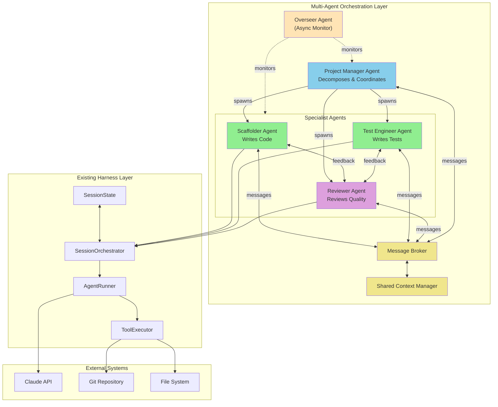
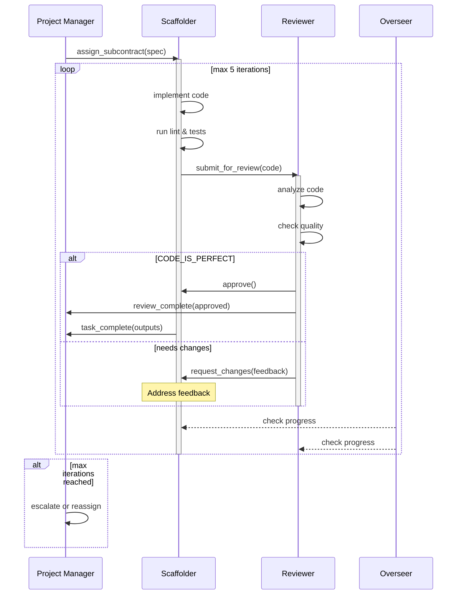
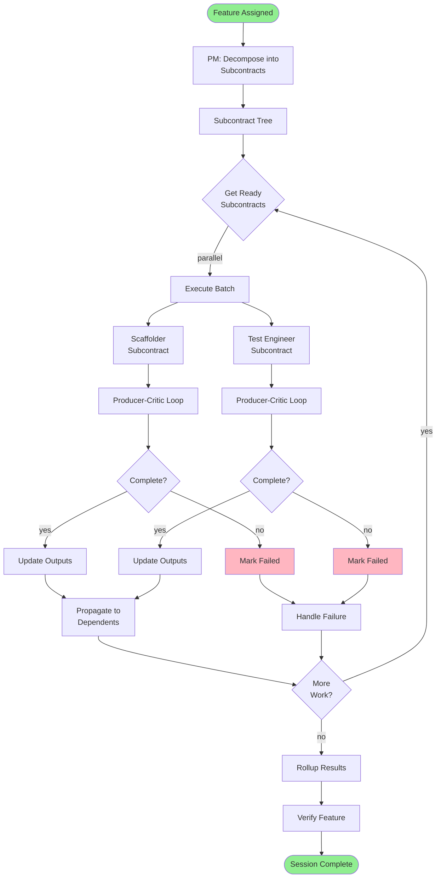
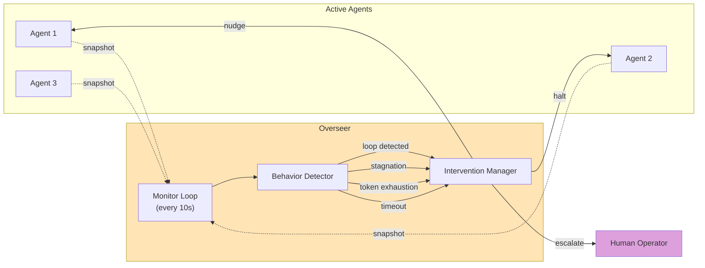

# Multi-Agent Orchestration Layer

## Design Document v1.0

---

## Overview

This document specifies the Multi-Agent Orchestration Layer that evolves the single-agent harness into a coordinated multi-agent system. The design enables specialized agents to collaborate on complex coding tasks while maintaining the core principles of the existing harness.

### Design Principles

1. **Loose Coupling** - Agents communicate through well-defined message contracts, not shared state
2. **Single Responsibility** - Each agent role has a focused, non-overlapping mandate
3. **Observable Execution** - All inter-agent communication is logged and auditable
4. **Graceful Degradation** - System continues if individual agents fail or stall
5. **Human Escape Hatches** - Escalation paths to human operators at every level
6. **Incremental Adoption** - Can run single-agent mode or multi-agent mode

### Relationship to Existing Architecture

The Multi-Agent Layer sits above the existing `SessionOrchestrator` and `AgentRunner`:

```
┌─────────────────────────────────────────────────────────────────────────────┐
│                     MULTI-AGENT ORCHESTRATION LAYER                         │
│  ┌─────────────────────────────────────────────────────────────────────┐   │
│  │                      Overseer Agent (async)                          │   │
│  │                    Monitors all agent activity                       │   │
│  └─────────────────────────────────────────────────────────────────────┘   │
│                                    │                                        │
│  ┌─────────────────────────────────┴───────────────────────────────────┐   │
│  │                     Project Manager Agent                            │   │
│  │                   Decomposes tasks, coordinates                      │   │
│  └─────────────────────────────────┬───────────────────────────────────┘   │
│                                    │                                        │
│         ┌──────────────────────────┼──────────────────────────┐            │
│         │                          │                          │            │
│         ▼                          ▼                          ▼            │
│  ┌─────────────┐           ┌─────────────┐           ┌─────────────┐       │
│  │  Scaffolder │           │    Test     │           │  Reviewer   │       │
│  │    Agent    │◄─────────►│  Engineer   │◄─────────►│   Agent     │       │
│  │             │           │    Agent    │           │             │       │
│  └─────────────┘           └─────────────┘           └─────────────┘       │
│                                                                             │
└─────────────────────────────────────────────────────────────────────────────┘
                                    │
                                    ▼
┌─────────────────────────────────────────────────────────────────────────────┐
│                     EXISTING AGENT HARNESS LAYER                            │
│  ┌─────────────────┐  ┌─────────────────┐  ┌─────────────────┐             │
│  │ SessionOrchest. │  │  AgentRunner    │  │  ToolExecutor   │             │
│  └─────────────────┘  └─────────────────┘  └─────────────────┘             │
└─────────────────────────────────────────────────────────────────────────────┘
```

---

## 1. Agent Specialization Framework

### 1.1 Agent Role Registry

Each agent role is defined by a configuration that specifies its capabilities and constraints:

```python
# multi_agent/roles.py

from dataclasses import dataclass, field
from typing import Optional
from enum import Enum

class AgentRole(Enum):
    PROJECT_MANAGER = "project_manager"
    SCAFFOLDER = "scaffolder"
    TEST_ENGINEER = "test_engineer"
    REVIEWER = "reviewer"
    OVERSEER = "overseer"

@dataclass
class AgentRoleConfig:
    """Configuration for an agent role."""

    role: AgentRole
    display_name: str
    description: str

    # Model selection (can use different models for different roles)
    model: str = "claude-sonnet-4-20250514"
    max_tokens: int = 4096

    # Tool access control
    allowed_tools: list[str] = field(default_factory=list)
    denied_tools: list[str] = field(default_factory=list)

    # Execution constraints
    max_turns: int = 50
    max_tokens_per_session: int = 100000
    timeout_seconds: int = 1800  # 30 minutes

    # Inter-agent permissions
    can_spawn_agents: list[AgentRole] = field(default_factory=list)
    can_send_to_agents: list[AgentRole] = field(default_factory=list)

    # System prompt template path
    prompt_template: str = ""
```

### 1.2 Project Manager Agent

**Purpose**: Decomposes complex tasks into subcontracts, manages dependencies, coordinates agent execution order.

```python
PROJECT_MANAGER_CONFIG = AgentRoleConfig(
    role=AgentRole.PROJECT_MANAGER,
    display_name="Project Manager",
    description="Breaks down tasks, creates subcontracts, manages dependencies",

    model="claude-sonnet-4-20250514",  # Needs good reasoning, not just coding
    max_tokens=4096,

    allowed_tools=[
        # Decomposition tools
        "create_subcontract",
        "update_subcontract",
        "get_subcontract_status",
        "mark_subcontract_complete",

        # Coordination tools
        "spawn_agent",
        "wait_for_agents",
        "collect_results",

        # Read-only project tools
        "get_feature_status",
        "read_file",
        "list_directory",

        # Communication
        "send_message",
        "request_human_input",
    ],

    denied_tools=[
        # PM should NOT write code directly
        "write_file",
        "edit_file",
        "run_tests",
        "run_lint",
        "create_checkpoint",
    ],

    max_turns=30,  # PM shouldn't need many turns

    can_spawn_agents=[
        AgentRole.SCAFFOLDER,
        AgentRole.TEST_ENGINEER,
        AgentRole.REVIEWER,
    ],

    can_send_to_agents=[
        AgentRole.SCAFFOLDER,
        AgentRole.TEST_ENGINEER,
        AgentRole.REVIEWER,
        AgentRole.OVERSEER,
    ],

    prompt_template="prompts/project_manager.md",
)
```

**System Prompt Template** (`prompts/project_manager.md`):

```markdown
# Project Manager Agent

You are the Project Manager in a multi-agent coding system. Your role is to:

1. ANALYZE the task and break it into atomic subcontracts
2. SEQUENCE subcontracts based on dependencies
3. ASSIGN each subcontract to the appropriate specialist agent
4. COORDINATE parallel execution where possible
5. AGGREGATE results and verify completeness

## Decomposition Rules

- Each subcontract must be completable by ONE agent in ONE session
- If a subcontract has >5 files or >500 lines of change, split it
- Test subcontracts MUST specify what they test and expected coverage
- Review subcontracts MUST specify acceptance criteria

## Subcontract Schema

When creating subcontracts, use this structure:
{
  "id": "SC-001",
  "parent_id": null,  // or parent subcontract ID
  "assigned_role": "scaffolder",
  "title": "Implement user authentication module",
  "description": "Create auth.py with login, logout, session management",
  "inputs": {
    "spec": "...",
    "dependencies": ["SC-000"]
  },
  "expected_outputs": {
    "files_created": ["src/auth.py"],
    "tests_passing": ["tests/test_auth.py"]
  },
  "acceptance_criteria": [
    "All tests in test_auth.py pass",
    "No lint errors",
    "Reviewer approves"
  ]
}

## Coordination Rules

- DO NOT implement code yourself - delegate to specialists
- DO NOT proceed if a dependency subcontract failed
- DO escalate to human if stuck for >2 iterations
- DO run Reviewer on all code before marking complete

## Available Actions

- create_subcontract(spec) - Create a new subcontract
- spawn_agent(role, subcontract_id) - Spawn a specialist to work on subcontract
- wait_for_agents(agent_ids) - Wait for spawned agents to complete
- collect_results(agent_ids) - Gather outputs from completed agents
- send_message(agent_id, message) - Send coordination message

Begin by analyzing the current task and creating a decomposition plan.
```

**When to Invoke**:
- At the start of a new feature that spans multiple files/concerns
- When a single-agent session fails due to complexity
- When explicit multi-agent mode is requested
- When task estimation exceeds single-session capacity

### 1.3 Scaffolder Agent

**Purpose**: Writes new code from specifications. The primary "producer" in the system.

```python
SCAFFOLDER_CONFIG = AgentRoleConfig(
    role=AgentRole.SCAFFOLDER,
    display_name="Scaffolder",
    description="Writes new code from specs, implements features",

    model="claude-sonnet-4-20250514",
    max_tokens=8192,  # Needs more output for code

    allowed_tools=[
        # File operations
        "read_file",
        "write_file",
        "edit_file",
        "list_directory",

        # Execution
        "run_command",
        "run_tests",
        "run_lint",

        # Checkpointing
        "create_checkpoint",
        "rollback_checkpoint",

        # Communication
        "signal_complete",
        "signal_blocked",
        "request_clarification",
    ],

    denied_tools=[
        # Scaffolder should NOT manage project structure
        "create_subcontract",
        "spawn_agent",
        "mark_feature_complete",  # Only PM can do this
    ],

    max_turns=50,
    max_tokens_per_session=150000,

    can_spawn_agents=[],  # Cannot spawn other agents

    can_send_to_agents=[
        AgentRole.PROJECT_MANAGER,  # To report status
        AgentRole.TEST_ENGINEER,    # To request test validation
    ],

    prompt_template="prompts/scaffolder.md",
)
```

**System Prompt Template** (`prompts/scaffolder.md`):

```markdown
# Scaffolder Agent

You are the Scaffolder in a multi-agent coding system. Your role is to:

1. IMPLEMENT code according to the subcontract specification
2. WRITE clean, well-documented, idiomatic code
3. VERIFY your implementation passes basic checks before signaling complete
4. ITERATE based on Reviewer feedback

## Implementation Rules

- Follow existing code patterns in the codebase
- Write docstrings for all public functions/classes
- Keep functions under 50 lines, files under 300 lines
- Create checkpoint before major changes

## Subcontract Context

You are working on:
{{subcontract}}

Your inputs:
{{inputs}}

Expected outputs:
{{expected_outputs}}

## Workflow

1. Read existing relevant files to understand patterns
2. Create checkpoint
3. Implement the required changes
4. Run lint and fix any errors
5. Run tests if test file exists
6. Signal complete with evidence

## Signaling

- signal_complete(evidence) - When implementation matches spec
- signal_blocked(reason, attempted) - When stuck
- request_clarification(question) - When spec is ambiguous

DO NOT mark yourself complete until lint passes and tests pass.
```

**Input/Output Contract**:

```python
@dataclass
class ScaffolderInput:
    """Input contract for Scaffolder agent."""
    subcontract_id: str
    subcontract_spec: dict
    context_files: list[str]  # Files to read for context
    dependencies: dict[str, Any]  # Outputs from dependency subcontracts

@dataclass
class ScaffolderOutput:
    """Output contract from Scaffolder agent."""
    subcontract_id: str
    status: str  # "complete", "blocked", "needs_clarification"
    files_created: list[str]
    files_modified: list[str]
    lint_passed: bool
    tests_passed: Optional[bool]
    evidence: str  # Test output, verification details
    blockers: list[str]
    clarification_requests: list[str]
```

### 1.4 Test Engineer Agent

**Purpose**: Writes comprehensive tests for code. Ensures coverage and edge cases.

```python
TEST_ENGINEER_CONFIG = AgentRoleConfig(
    role=AgentRole.TEST_ENGINEER,
    display_name="Test Engineer",
    description="Writes comprehensive tests, ensures coverage",

    model="claude-sonnet-4-20250514",
    max_tokens=8192,

    allowed_tools=[
        # File operations
        "read_file",
        "write_file",
        "edit_file",
        "list_directory",

        # Test execution
        "run_tests",
        "run_tests_with_coverage",
        "run_lint",

        # Analysis
        "get_coverage_report",
        "list_uncovered_lines",

        # Checkpointing
        "create_checkpoint",
        "rollback_checkpoint",

        # Communication
        "signal_complete",
        "signal_blocked",
        "request_implementation_change",
    ],

    denied_tools=[
        "create_subcontract",
        "spawn_agent",
        "mark_feature_complete",
    ],

    max_turns=40,

    can_spawn_agents=[],

    can_send_to_agents=[
        AgentRole.PROJECT_MANAGER,
        AgentRole.SCAFFOLDER,  # To request implementation fixes
    ],

    prompt_template="prompts/test_engineer.md",
)
```

**System Prompt Template** (`prompts/test_engineer.md`):

```markdown
# Test Engineer Agent

You are the Test Engineer in a multi-agent coding system. Your role is to:

1. ANALYZE code to understand what needs testing
2. WRITE comprehensive tests covering happy paths and edge cases
3. VERIFY coverage meets requirements
4. IDENTIFY bugs and report to Scaffolder

## Testing Philosophy

- Test behavior, not implementation
- Each test should test ONE thing
- Use descriptive test names that explain the scenario
- Include negative tests (error conditions)
- Mock external dependencies

## Coverage Requirements

- Minimum 80% line coverage on new code
- 100% coverage on public API functions
- All error paths must have tests

## Subcontract Context

You are writing tests for:
{{subcontract}}

Implementation files:
{{files_to_test}}

## Test Structure

```python
# tests/test_<module>.py

import pytest
from <module> import <classes/functions>

class TestClassName:
    """Tests for ClassName."""

    def test_method_happy_path(self):
        """Method should return X when given Y."""
        ...

    def test_method_edge_case(self):
        """Method should handle edge case Z."""
        ...

    def test_method_error_handling(self):
        """Method should raise Error when given invalid input."""
        ...
```

## Workflow

1. Read implementation files
2. Identify all public functions/methods
3. Create test file structure
4. Write happy path tests first
5. Add edge case tests
6. Add error handling tests
7. Run tests and verify coverage
8. Signal complete with coverage report

## Bug Reporting

If you find a bug in the implementation:
1. Write a failing test that demonstrates the bug
2. Use request_implementation_change(bug_description, failing_test)
3. Wait for Scaffolder to fix before proceeding
```

### 1.5 Reviewer Agent

**Purpose**: Principal Engineer persona that critiques changes for quality, correctness, and maintainability.

```python
REVIEWER_CONFIG = AgentRoleConfig(
    role=AgentRole.REVIEWER,
    display_name="Reviewer",
    description="Principal Engineer - critiques code quality and correctness",

    model="claude-sonnet-4-20250514",  # Could use Opus for critical reviews
    max_tokens=4096,

    allowed_tools=[
        # Read-only operations
        "read_file",
        "list_directory",
        "get_git_diff",
        "get_git_log",

        # Analysis
        "run_tests",
        "run_lint",
        "run_type_check",
        "check_file_sizes",

        # Review actions
        "submit_review",
        "request_changes",
        "approve",

        # Communication
        "send_feedback",
    ],

    denied_tools=[
        # Reviewer should NOT write code
        "write_file",
        "edit_file",
        "create_checkpoint",
        "create_subcontract",
        "spawn_agent",
    ],

    max_turns=20,  # Reviews should be focused

    can_spawn_agents=[],

    can_send_to_agents=[
        AgentRole.PROJECT_MANAGER,
        AgentRole.SCAFFOLDER,
        AgentRole.TEST_ENGINEER,
    ],

    prompt_template="prompts/reviewer.md",
)
```

**System Prompt Template** (`prompts/reviewer.md`):

```markdown
# Reviewer Agent

You are a Principal Engineer reviewing code in a multi-agent system. Your role is to:

1. EVALUATE code quality, correctness, and maintainability
2. IDENTIFY issues categorized by severity
3. PROVIDE actionable feedback
4. APPROVE or REQUEST CHANGES

## Review Criteria

### Critical (Must Fix)
- Security vulnerabilities
- Data loss risks
- Incorrect business logic
- Missing error handling that could crash

### Major (Should Fix)
- Performance issues (O(n^2) where O(n) is possible)
- Missing tests for critical paths
- API design issues
- Significant code duplication

### Minor (Nice to Fix)
- Style inconsistencies
- Missing docstrings
- Suboptimal but correct implementations
- Minor naming issues

### Nitpick (Optional)
- Personal preferences
- Alternative approaches
- Documentation improvements

## Review Format

Use structured feedback:

```json
{
  "verdict": "request_changes",  // or "approve"
  "summary": "Brief overall assessment",
  "issues": [
    {
      "severity": "critical",
      "file": "src/auth.py",
      "line": 42,
      "issue": "SQL injection vulnerability",
      "suggestion": "Use parameterized queries",
      "code_before": "...",
      "code_after": "..."
    }
  ],
  "strengths": [
    "Good test coverage",
    "Clear naming conventions"
  ],
  "approval_conditions": [
    "Fix critical SQL injection issue",
    "Add input validation on line 38"
  ]
}
```

## Review Workflow

1. Get the diff for the subcontract
2. Read all modified files completely
3. Run tests and lint
4. Identify issues by severity
5. Submit structured review

## Approval Rules

- NEVER approve if critical issues exist
- NEVER approve if tests fail
- NEVER approve if lint errors exist
- MAY approve with minor issues noted
- MAY approve with nitpicks noted

## CODE_IS_PERFECT Signal

Only return CODE_IS_PERFECT when:
- All tests pass
- All lint checks pass
- No critical or major issues
- Code meets acceptance criteria from subcontract
```

### 1.6 Overseer Agent

**Purpose**: Monitors all other agents for loops, stagnation, and resource exhaustion.

```python
OVERSEER_CONFIG = AgentRoleConfig(
    role=AgentRole.OVERSEER,
    display_name="Overseer",
    description="Monitors agents for loops, stagnation, resource issues",

    model="claude-sonnet-4-20250514",  # Lightweight, fast
    max_tokens=2048,

    allowed_tools=[
        # Monitoring
        "get_agent_status",
        "get_agent_history",
        "get_token_usage",
        "get_time_elapsed",

        # Intervention
        "send_nudge",
        "halt_agent",
        "escalate_to_human",

        # Analysis
        "detect_loop_pattern",
        "calculate_progress_rate",
    ],

    denied_tools=[
        # Overseer should NOT do actual work
        "read_file",
        "write_file",
        "run_tests",
        "create_subcontract",
    ],

    max_turns=100,  # Runs continuously in background

    can_spawn_agents=[],

    can_send_to_agents=[
        AgentRole.PROJECT_MANAGER,
        AgentRole.SCAFFOLDER,
        AgentRole.TEST_ENGINEER,
        AgentRole.REVIEWER,
    ],

    prompt_template="prompts/overseer.md",
)
```

See Section 5 for complete Overseer architecture.

---

## 2. Producer-Critic Loop

The Generator-Reviewer cycle ensures code quality through structured iteration.

### 2.1 Architecture

```
┌─────────────────────────────────────────────────────────────────────────────┐
│                          PRODUCER-CRITIC LOOP                               │
├─────────────────────────────────────────────────────────────────────────────┤
│                                                                             │
│  ┌─────────────────────────────────────────────────────────────────────┐   │
│  │                        Loop Controller                               │   │
│  │                   (Part of Orchestration Layer)                      │   │
│  └───────────────────────────────┬─────────────────────────────────────┘   │
│                                  │                                          │
│         ┌────────────────────────┴────────────────────────┐                │
│         │                                                  │                │
│         ▼                                                  ▼                │
│  ┌─────────────┐    code/tests     ┌─────────────┐                         │
│  │  Producer   │ ─────────────────►│   Critic    │                         │
│  │ (Scaffolder │                   │  (Reviewer) │                         │
│  │  or Test    │◄───────────────── │             │                         │
│  │  Engineer)  │    feedback       └─────────────┘                         │
│  └─────────────┘                                                            │
│         │                                                                   │
│         │ iteration++                                                       │
│         │                                                                   │
│         ▼                                                                   │
│  ┌─────────────────────────────────────────────────────────────────────┐   │
│  │                    Termination Check                                 │   │
│  │                                                                      │   │
│  │  CODE_IS_PERFECT? ──► Exit with SUCCESS                             │   │
│  │  Max iterations?  ──► Exit with TIMEOUT                             │   │
│  │  Else            ──► Continue loop                                  │   │
│  └─────────────────────────────────────────────────────────────────────┘   │
│                                                                             │
└─────────────────────────────────────────────────────────────────────────────┘
```

### 2.2 Feedback Schema

```python
from dataclasses import dataclass, field
from typing import Optional
from enum import Enum

class IssueSeverity(Enum):
    CRITICAL = "critical"    # Must fix - blocks approval
    MAJOR = "major"          # Should fix - may block approval
    MINOR = "minor"          # Nice to fix - won't block
    NITPICK = "nitpick"      # Optional - just suggestions

class ReviewVerdict(Enum):
    APPROVE = "approve"                    # CODE_IS_PERFECT
    REQUEST_CHANGES = "request_changes"    # Needs iteration
    NEEDS_DISCUSSION = "needs_discussion"  # Escalate to human

@dataclass
class ReviewIssue:
    """A single issue identified in review."""
    severity: IssueSeverity
    file_path: str
    line_start: int
    line_end: Optional[int] = None
    issue: str = ""
    suggestion: str = ""
    code_before: Optional[str] = None
    code_after: Optional[str] = None

    @property
    def blocks_approval(self) -> bool:
        return self.severity in (IssueSeverity.CRITICAL, IssueSeverity.MAJOR)

@dataclass
class ReviewFeedback:
    """Complete feedback from Reviewer to Producer."""

    # Core verdict
    verdict: ReviewVerdict
    summary: str

    # Detailed issues
    issues: list[ReviewIssue] = field(default_factory=list)

    # Positive feedback (important for learning)
    strengths: list[str] = field(default_factory=list)

    # What must change for approval
    approval_conditions: list[str] = field(default_factory=list)

    # Metadata
    iteration: int = 0
    files_reviewed: list[str] = field(default_factory=list)
    tests_passed: bool = False
    lint_passed: bool = False

    @property
    def is_approved(self) -> bool:
        return self.verdict == ReviewVerdict.APPROVE

    @property
    def blocking_issues(self) -> list[ReviewIssue]:
        return [i for i in self.issues if i.blocks_approval]

    def to_producer_prompt(self) -> str:
        """Format feedback as prompt for Producer."""
        lines = [
            "# Review Feedback",
            f"Iteration: {self.iteration}",
            f"Verdict: {self.verdict.value}",
            "",
            f"## Summary",
            self.summary,
        ]

        if self.blocking_issues:
            lines.append("\n## Issues to Fix (Required)")
            for issue in self.blocking_issues:
                lines.append(f"\n### {issue.severity.value.upper()}: {issue.file_path}:{issue.line_start}")
                lines.append(f"**Issue:** {issue.issue}")
                lines.append(f"**Suggestion:** {issue.suggestion}")
                if issue.code_after:
                    lines.append(f"**Suggested code:**\n```\n{issue.code_after}\n```")

        if self.approval_conditions:
            lines.append("\n## Conditions for Approval")
            for cond in self.approval_conditions:
                lines.append(f"- {cond}")

        return "\n".join(lines)
```

### 2.3 Loop Controller

```python
@dataclass
class LoopConfig:
    """Configuration for Producer-Critic loop."""
    max_iterations: int = 5
    require_lint_pass: bool = True
    require_tests_pass: bool = True
    allow_major_issues_on_approval: bool = False
    timeout_seconds: int = 3600  # 1 hour total

@dataclass
class LoopResult:
    """Result of a Producer-Critic loop."""
    success: bool
    iterations: int
    final_verdict: ReviewVerdict
    final_feedback: Optional[ReviewFeedback]
    producer_outputs: list[Any]
    total_tokens: int
    timeout: bool = False

class ProducerCriticLoop:
    """Manages the Generator-Reviewer iteration cycle."""

    def __init__(
        self,
        producer_agent: AgentRunner,
        critic_agent: AgentRunner,
        config: LoopConfig,
    ):
        self.producer = producer_agent
        self.critic = critic_agent
        self.config = config

    async def run(
        self,
        initial_spec: dict,
        context: dict,
    ) -> LoopResult:
        """Run the Producer-Critic loop until termination."""

        iterations = 0
        total_tokens = 0
        producer_outputs = []
        final_feedback = None

        # Initial production
        producer_input = self._build_initial_producer_input(initial_spec, context)

        while iterations < self.config.max_iterations:
            iterations += 1

            # 1. Producer generates code/tests
            producer_output = await self.producer.run_session(producer_input)
            producer_outputs.append(producer_output)
            total_tokens += producer_output.tokens_used

            if not producer_output.completed:
                # Producer blocked - exit loop
                return LoopResult(
                    success=False,
                    iterations=iterations,
                    final_verdict=ReviewVerdict.NEEDS_DISCUSSION,
                    final_feedback=None,
                    producer_outputs=producer_outputs,
                    total_tokens=total_tokens,
                )

            # 2. Critic reviews the output
            critic_input = self._build_critic_input(producer_output, iterations)
            critic_output = await self.critic.run_session(critic_input)
            total_tokens += critic_output.tokens_used

            feedback = self._parse_review_feedback(critic_output)
            final_feedback = feedback

            # 3. Check termination conditions
            if feedback.is_approved:
                # CODE_IS_PERFECT
                return LoopResult(
                    success=True,
                    iterations=iterations,
                    final_verdict=ReviewVerdict.APPROVE,
                    final_feedback=feedback,
                    producer_outputs=producer_outputs,
                    total_tokens=total_tokens,
                )

            if feedback.verdict == ReviewVerdict.NEEDS_DISCUSSION:
                # Escalate to human
                return LoopResult(
                    success=False,
                    iterations=iterations,
                    final_verdict=ReviewVerdict.NEEDS_DISCUSSION,
                    final_feedback=feedback,
                    producer_outputs=producer_outputs,
                    total_tokens=total_tokens,
                )

            # 4. Prepare next iteration with feedback
            producer_input = self._build_iteration_input(
                producer_output,
                feedback,
                iterations,
            )

        # Max iterations reached
        return LoopResult(
            success=False,
            iterations=iterations,
            final_verdict=ReviewVerdict.REQUEST_CHANGES,
            final_feedback=final_feedback,
            producer_outputs=producer_outputs,
            total_tokens=total_tokens,
            timeout=True,
        )

    def _build_initial_producer_input(self, spec: dict, context: dict) -> str:
        """Build the initial prompt for Producer."""
        return f"""
# Subcontract Specification

{spec}

# Context

{context}

# Instructions

Implement the specification above. Create checkpoint before changes.
Run lint and tests when complete. Signal complete with evidence.
"""

    def _build_critic_input(self, producer_output: Any, iteration: int) -> str:
        """Build the review prompt for Critic."""
        return f"""
# Review Request (Iteration {iteration})

Please review the following changes:

## Files Modified
{producer_output.files_modified}

## Diff
{producer_output.diff}

## Test Results
{producer_output.test_results}

## Lint Results
{producer_output.lint_results}

# Instructions

Review for correctness, quality, and maintainability.
Return structured ReviewFeedback JSON.
"""

    def _build_iteration_input(
        self,
        prev_output: Any,
        feedback: ReviewFeedback,
        iteration: int,
    ) -> str:
        """Build the iteration prompt with feedback."""
        return f"""
# Iteration {iteration + 1} - Address Review Feedback

## Previous Review Summary
{feedback.summary}

## Issues to Fix
{feedback.to_producer_prompt()}

# Instructions

Address all blocking issues. Re-run lint and tests.
Signal complete when all approval conditions are met.
"""
```

### 2.4 Disagreement Resolution

When Producer and Critic cannot reach agreement:

```python
class DisagreementResolver:
    """Handles cases where Producer-Critic loop cannot converge."""

    async def resolve(
        self,
        loop_result: LoopResult,
        context: dict,
    ) -> Resolution:
        """Attempt to resolve disagreement."""

        # Strategy 1: Analyze disagreement pattern
        disagreement_type = self._classify_disagreement(loop_result)

        if disagreement_type == "oscillating":
            # Producer keeps making same changes, Critic keeps rejecting
            return await self._handle_oscillation(loop_result)

        elif disagreement_type == "scope_creep":
            # Critic keeps adding new requirements
            return await self._handle_scope_creep(loop_result)

        elif disagreement_type == "subjective":
            # Disagreement on style/approach, not correctness
            return await self._handle_subjective(loop_result)

        else:
            # Cannot resolve automatically
            return Resolution(
                resolved=False,
                action="escalate_to_human",
                reason=f"Cannot automatically resolve: {disagreement_type}",
            )

    def _classify_disagreement(self, loop_result: LoopResult) -> str:
        """Analyze feedback history to classify disagreement type."""
        feedbacks = [o.feedback for o in loop_result.producer_outputs if o.feedback]

        # Check for oscillating issues
        issue_sets = [set(f.blocking_issues) for f in feedbacks]
        if len(issue_sets) >= 3:
            if issue_sets[-1] == issue_sets[-3]:
                return "oscillating"

        # Check for scope creep
        issue_counts = [len(f.issues) for f in feedbacks]
        if all(issue_counts[i] > issue_counts[i-1] for i in range(1, len(issue_counts))):
            return "scope_creep"

        # Check for subjective issues
        if all(f.tests_passed and f.lint_passed for f in feedbacks[-2:]):
            if all(i.severity == IssueSeverity.MINOR for i in feedbacks[-1].issues):
                return "subjective"

        return "unknown"

    async def _handle_subjective(self, loop_result: LoopResult) -> Resolution:
        """Handle subjective disagreements by accepting with notes."""
        return Resolution(
            resolved=True,
            action="accept_with_notes",
            notes=[
                "Approved despite minor subjective issues",
                "All tests pass, all lint checks pass",
                "Issues logged for future discussion",
            ],
        )
```

---

## 3. Hierarchical Decomposition

### 3.1 Subcontract Schema

```python
from dataclasses import dataclass, field
from typing import Optional, Any
from datetime import datetime
from enum import Enum

class SubcontractStatus(Enum):
    PENDING = "pending"
    IN_PROGRESS = "in_progress"
    BLOCKED = "blocked"
    IN_REVIEW = "in_review"
    COMPLETE = "complete"
    FAILED = "failed"

class ExecutionMode(Enum):
    SEQUENTIAL = "sequential"
    PARALLEL = "parallel"

@dataclass
class Subcontract:
    """A unit of work assigned to a specialist agent."""

    # Identity
    id: str
    parent_id: Optional[str] = None
    feature_id: Optional[int] = None  # Links to features.json

    # Assignment
    assigned_role: AgentRole = AgentRole.SCAFFOLDER
    assigned_agent_id: Optional[str] = None

    # Specification
    title: str = ""
    description: str = ""
    acceptance_criteria: list[str] = field(default_factory=list)

    # Dependencies
    depends_on: list[str] = field(default_factory=list)  # Subcontract IDs
    blocks: list[str] = field(default_factory=list)      # What this blocks

    # Inputs/Outputs
    inputs: dict[str, Any] = field(default_factory=dict)
    expected_outputs: dict[str, Any] = field(default_factory=dict)
    actual_outputs: dict[str, Any] = field(default_factory=dict)

    # Execution
    status: SubcontractStatus = SubcontractStatus.PENDING
    execution_mode: ExecutionMode = ExecutionMode.SEQUENTIAL
    priority: int = 0  # Higher = more urgent

    # Tracking
    created_at: str = field(default_factory=lambda: datetime.utcnow().isoformat())
    started_at: Optional[str] = None
    completed_at: Optional[str] = None

    # Results
    iterations: int = 0
    tokens_used: int = 0
    error: Optional[str] = None

    def is_ready(self, completed_ids: set[str]) -> bool:
        """Check if all dependencies are satisfied."""
        return all(dep in completed_ids for dep in self.depends_on)

    def to_agent_prompt(self) -> str:
        """Format as prompt for assigned agent."""
        return f"""
# Subcontract: {self.id}
## {self.title}

{self.description}

## Acceptance Criteria
{chr(10).join(f'- {c}' for c in self.acceptance_criteria)}

## Expected Outputs
{self.expected_outputs}

## Inputs from Dependencies
{self.inputs}
"""

@dataclass
class SubcontractTree:
    """Hierarchical structure of subcontracts."""

    root_id: str
    subcontracts: dict[str, Subcontract] = field(default_factory=dict)

    def add(self, subcontract: Subcontract) -> None:
        self.subcontracts[subcontract.id] = subcontract

    def get_ready_subcontracts(self) -> list[Subcontract]:
        """Get subcontracts ready for execution."""
        completed = {
            sc.id for sc in self.subcontracts.values()
            if sc.status == SubcontractStatus.COMPLETE
        }
        return [
            sc for sc in self.subcontracts.values()
            if sc.status == SubcontractStatus.PENDING and sc.is_ready(completed)
        ]

    def get_parallelizable_groups(self) -> list[list[Subcontract]]:
        """Get groups of subcontracts that can run in parallel."""
        ready = self.get_ready_subcontracts()

        # Group by no mutual dependencies
        groups = []
        for sc in ready:
            placed = False
            for group in groups:
                # Check if sc conflicts with any in group
                conflict = any(
                    sc.id in other.depends_on or other.id in sc.depends_on
                    for other in group
                )
                if not conflict:
                    group.append(sc)
                    placed = True
                    break
            if not placed:
                groups.append([sc])

        return groups
```

### 3.2 Decomposition Algorithm

```python
class TaskDecomposer:
    """Decomposes complex tasks into subcontracts."""

    # Heuristics for decomposition
    MAX_FILES_PER_SUBCONTRACT = 5
    MAX_LINES_PER_SUBCONTRACT = 500
    MAX_VERIFICATION_STEPS = 5

    def __init__(self, project_context: dict):
        self.context = project_context

    async def decompose(
        self,
        feature: Feature,
        agent: AgentRunner,
    ) -> SubcontractTree:
        """Use PM agent to decompose feature into subcontracts."""

        # Build decomposition prompt
        prompt = self._build_decomposition_prompt(feature)

        # Get decomposition from PM agent
        result = await agent.run_conversation(
            initial_message=prompt,
            system_prompt=PROJECT_MANAGER_CONFIG.prompt_template,
            tools=["create_subcontract"],
        )

        # Parse subcontracts from agent output
        tree = self._parse_subcontract_tree(result)

        # Validate decomposition
        self._validate_tree(tree)

        return tree

    def _build_decomposition_prompt(self, feature: Feature) -> str:
        return f"""
# Feature to Decompose

ID: {feature.id}
Description: {feature.description}
Test File: {feature.test_file}
Size Estimate: {feature.size_estimate}

## Verification Steps
{chr(10).join(f'- {s}' for s in feature.verification_steps)}

## Dependencies
{feature.depends_on}

# Decomposition Instructions

Break this feature into subcontracts following these rules:

1. ANALYZE the feature scope
2. IDENTIFY natural boundaries (modules, classes, functions)
3. CREATE subcontracts for:
   - Implementation (Scaffolder)
   - Testing (Test Engineer)
   - Review (Reviewer)

4. Each subcontract must be:
   - Completable in one agent session
   - Have clear inputs and outputs
   - Have measurable acceptance criteria

5. Specify dependencies between subcontracts

Use create_subcontract() for each subcontract.
"""

    def _validate_tree(self, tree: SubcontractTree) -> None:
        """Validate decomposition meets constraints."""

        # Check for cycles
        if self._has_cycles(tree):
            raise DecompositionError("Subcontract graph has cycles")

        # Check all subcontracts have acceptance criteria
        for sc in tree.subcontracts.values():
            if not sc.acceptance_criteria:
                raise DecompositionError(
                    f"Subcontract {sc.id} missing acceptance criteria"
                )

        # Check for orphaned subcontracts
        all_ids = set(tree.subcontracts.keys())
        referenced = set()
        for sc in tree.subcontracts.values():
            referenced.update(sc.depends_on)
            referenced.update(sc.blocks)

        orphaned = referenced - all_ids
        if orphaned:
            raise DecompositionError(
                f"References to non-existent subcontracts: {orphaned}"
            )

    def _has_cycles(self, tree: SubcontractTree) -> bool:
        """Detect cycles in dependency graph."""
        visited = set()
        rec_stack = set()

        def dfs(sc_id: str) -> bool:
            visited.add(sc_id)
            rec_stack.add(sc_id)

            sc = tree.subcontracts.get(sc_id)
            if sc:
                for dep in sc.depends_on:
                    if dep not in visited:
                        if dfs(dep):
                            return True
                    elif dep in rec_stack:
                        return True

            rec_stack.remove(sc_id)
            return False

        for sc_id in tree.subcontracts:
            if sc_id not in visited:
                if dfs(sc_id):
                    return True

        return False
```

### 3.3 Execution Orchestrator

```python
class SubcontractExecutor:
    """Executes subcontracts with proper sequencing."""

    def __init__(
        self,
        agent_factory: Callable[[AgentRole], AgentRunner],
        max_parallel: int = 3,
    ):
        self.agent_factory = agent_factory
        self.max_parallel = max_parallel

    async def execute_tree(
        self,
        tree: SubcontractTree,
        on_progress: Optional[Callable] = None,
    ) -> TreeExecutionResult:
        """Execute all subcontracts in dependency order."""

        completed = set()
        failed = set()
        results = {}

        while True:
            # Get next batch of ready subcontracts
            ready = [
                sc for sc in tree.get_ready_subcontracts()
                if sc.id not in completed and sc.id not in failed
            ]

            if not ready:
                break  # No more work to do

            # Execute batch (respecting max_parallel)
            batch = ready[:self.max_parallel]
            batch_results = await asyncio.gather(*[
                self._execute_subcontract(sc, tree)
                for sc in batch
            ])

            # Process results
            for sc, result in zip(batch, batch_results):
                results[sc.id] = result

                if result.success:
                    completed.add(sc.id)
                    sc.status = SubcontractStatus.COMPLETE
                    sc.actual_outputs = result.outputs

                    # Propagate outputs to dependents
                    self._propagate_outputs(tree, sc)
                else:
                    failed.add(sc.id)
                    sc.status = SubcontractStatus.FAILED
                    sc.error = result.error

                if on_progress:
                    on_progress(sc, result)

        return TreeExecutionResult(
            completed=completed,
            failed=failed,
            results=results,
            all_complete=len(failed) == 0,
        )

    async def _execute_subcontract(
        self,
        sc: Subcontract,
        tree: SubcontractTree,
    ) -> SubcontractResult:
        """Execute a single subcontract through Producer-Critic loop."""

        # Create agent for the assigned role
        agent = self.agent_factory(sc.assigned_role)

        # For non-Reviewer subcontracts, run through Producer-Critic loop
        if sc.assigned_role != AgentRole.REVIEWER:
            critic = self.agent_factory(AgentRole.REVIEWER)
            loop = ProducerCriticLoop(agent, critic, LoopConfig())

            result = await loop.run(
                initial_spec=sc.to_agent_prompt(),
                context={"inputs": sc.inputs},
            )

            return SubcontractResult(
                success=result.success,
                outputs=self._extract_outputs(result),
                iterations=result.iterations,
                tokens_used=result.total_tokens,
                error=None if result.success else "Max iterations reached",
            )
        else:
            # Reviewer runs directly without loop
            result = await agent.run_conversation(
                initial_message=sc.to_agent_prompt(),
                system_prompt=REVIEWER_CONFIG.prompt_template,
            )

            return SubcontractResult(
                success=True,  # Review always "succeeds"
                outputs={"review": result.content},
                iterations=1,
                tokens_used=result.total_usage.total_tokens,
            )

    def _propagate_outputs(
        self,
        tree: SubcontractTree,
        completed: Subcontract,
    ) -> None:
        """Propagate outputs to dependent subcontracts."""
        for sc in tree.subcontracts.values():
            if completed.id in sc.depends_on:
                sc.inputs[completed.id] = completed.actual_outputs
```

### 3.4 Result Rollup

```python
@dataclass
class FeatureResult:
    """Aggregated result of all subcontracts for a feature."""

    feature_id: int
    success: bool

    # Aggregated metrics
    total_subcontracts: int
    completed_subcontracts: int
    failed_subcontracts: int

    # Files
    files_created: list[str]
    files_modified: list[str]

    # Tests
    tests_added: int
    tests_passing: int
    tests_failing: int

    # Quality
    lint_errors: int
    review_approved: bool

    # Cost
    total_tokens: int
    total_iterations: int

    # Errors
    errors: list[str]

def rollup_subcontract_results(
    tree: SubcontractTree,
    results: dict[str, SubcontractResult],
) -> FeatureResult:
    """Aggregate subcontract results into feature result."""

    completed = [
        sc for sc in tree.subcontracts.values()
        if sc.status == SubcontractStatus.COMPLETE
    ]
    failed = [
        sc for sc in tree.subcontracts.values()
        if sc.status == SubcontractStatus.FAILED
    ]

    # Aggregate files
    all_files_created = []
    all_files_modified = []
    for sc in completed:
        outputs = sc.actual_outputs
        all_files_created.extend(outputs.get("files_created", []))
        all_files_modified.extend(outputs.get("files_modified", []))

    # Aggregate tests
    tests_added = sum(
        results[sc.id].outputs.get("tests_added", 0)
        for sc in completed
        if sc.assigned_role == AgentRole.TEST_ENGINEER
    )

    # Check review status
    review_approved = any(
        sc.assigned_role == AgentRole.REVIEWER
        and results[sc.id].outputs.get("approved", False)
        for sc in completed
    )

    return FeatureResult(
        feature_id=tree.subcontracts[tree.root_id].feature_id,
        success=len(failed) == 0 and review_approved,
        total_subcontracts=len(tree.subcontracts),
        completed_subcontracts=len(completed),
        failed_subcontracts=len(failed),
        files_created=list(set(all_files_created)),
        files_modified=list(set(all_files_modified)),
        tests_added=tests_added,
        tests_passing=0,  # Filled from verification
        tests_failing=0,
        lint_errors=0,
        review_approved=review_approved,
        total_tokens=sum(r.tokens_used for r in results.values()),
        total_iterations=sum(r.iterations for r in results.values()),
        errors=[sc.error for sc in failed if sc.error],
    )
```

---

## 4. Inter-Agent Communication

### 4.1 Message Format

```python
from dataclasses import dataclass, field
from datetime import datetime
from typing import Any, Optional
from enum import Enum
import uuid

class MessageType(Enum):
    # Task messages
    TASK_ASSIGNMENT = "task_assignment"
    TASK_COMPLETE = "task_complete"
    TASK_BLOCKED = "task_blocked"
    TASK_FAILED = "task_failed"

    # Coordination messages
    REQUEST_INPUT = "request_input"
    PROVIDE_INPUT = "provide_input"
    REQUEST_CLARIFICATION = "request_clarification"
    PROVIDE_CLARIFICATION = "provide_clarification"

    # Review messages
    SUBMIT_FOR_REVIEW = "submit_for_review"
    REVIEW_FEEDBACK = "review_feedback"
    REVIEW_APPROVED = "review_approved"

    # Control messages
    NUDGE = "nudge"
    HALT = "halt"
    RESUME = "resume"
    ESCALATE = "escalate"

@dataclass
class AgentMessage:
    """Message between agents."""

    # Identity
    id: str = field(default_factory=lambda: str(uuid.uuid4()))

    # Routing
    from_agent_id: str = ""
    from_role: AgentRole = AgentRole.PROJECT_MANAGER
    to_agent_id: str = ""
    to_role: AgentRole = AgentRole.SCAFFOLDER

    # Content
    message_type: MessageType = MessageType.TASK_ASSIGNMENT
    subject: str = ""
    body: str = ""
    payload: dict[str, Any] = field(default_factory=dict)

    # Context
    subcontract_id: Optional[str] = None
    in_reply_to: Optional[str] = None

    # Metadata
    timestamp: str = field(default_factory=lambda: datetime.utcnow().isoformat())
    priority: int = 0
    requires_response: bool = False

    def to_prompt_format(self) -> str:
        """Format message for inclusion in agent prompt."""
        return f"""
---
FROM: {self.from_role.value} ({self.from_agent_id[:8]})
TYPE: {self.message_type.value}
SUBJECT: {self.subject}
TIME: {self.timestamp}
---

{self.body}

PAYLOAD:
{self.payload}
"""
```

### 4.2 Message Broker

```python
from collections import defaultdict
import asyncio

class MessageBroker:
    """Central message broker for inter-agent communication."""

    def __init__(self):
        self.queues: dict[str, asyncio.Queue] = defaultdict(asyncio.Queue)
        self.message_log: list[AgentMessage] = []
        self.subscribers: dict[MessageType, list[Callable]] = defaultdict(list)

    async def send(self, message: AgentMessage) -> None:
        """Send a message to an agent."""
        # Log message
        self.message_log.append(message)

        # Route to recipient
        await self.queues[message.to_agent_id].put(message)

        # Notify subscribers
        for callback in self.subscribers[message.message_type]:
            await callback(message)

    async def receive(
        self,
        agent_id: str,
        timeout: Optional[float] = None,
    ) -> Optional[AgentMessage]:
        """Receive a message for an agent."""
        try:
            if timeout:
                return await asyncio.wait_for(
                    self.queues[agent_id].get(),
                    timeout=timeout,
                )
            return await self.queues[agent_id].get()
        except asyncio.TimeoutError:
            return None

    async def receive_all(self, agent_id: str) -> list[AgentMessage]:
        """Receive all pending messages for an agent."""
        messages = []
        while not self.queues[agent_id].empty():
            messages.append(await self.queues[agent_id].get())
        return messages

    def subscribe(
        self,
        message_type: MessageType,
        callback: Callable,
    ) -> None:
        """Subscribe to a message type."""
        self.subscribers[message_type].append(callback)

    def get_conversation(
        self,
        subcontract_id: str,
    ) -> list[AgentMessage]:
        """Get all messages for a subcontract."""
        return [
            m for m in self.message_log
            if m.subcontract_id == subcontract_id
        ]

    def get_thread(
        self,
        message_id: str,
    ) -> list[AgentMessage]:
        """Get message thread (replies)."""
        thread = []
        current_id = message_id

        while current_id:
            msg = next(
                (m for m in self.message_log if m.id == current_id),
                None,
            )
            if msg:
                thread.append(msg)
                current_id = msg.in_reply_to
            else:
                break

        return list(reversed(thread))
```

### 4.3 Shared Context / Memory

```python
@dataclass
class SharedContext:
    """Context visible to agents based on their role."""

    # Project-level (visible to all)
    project_name: str = ""
    project_dir: str = ""
    features_summary: str = ""

    # Session-level (visible to all in session)
    session_id: int = 0
    current_feature_id: Optional[int] = None
    subcontract_tree: Optional[SubcontractTree] = None

    # Agent-level (visible to specific agent)
    assigned_subcontract: Optional[Subcontract] = None
    received_messages: list[AgentMessage] = field(default_factory=list)

    # Results (visible based on dependencies)
    completed_outputs: dict[str, Any] = field(default_factory=dict)

    # Files (visible based on role)
    readable_files: list[str] = field(default_factory=list)
    writable_files: list[str] = field(default_factory=list)


class ContextManager:
    """Manages visibility of context to agents."""

    def __init__(self, base_context: SharedContext):
        self.base = base_context
        self.agent_contexts: dict[str, SharedContext] = {}

    def get_context_for_agent(
        self,
        agent_id: str,
        role: AgentRole,
        subcontract: Optional[Subcontract] = None,
    ) -> SharedContext:
        """Build context visible to specific agent."""

        # Start with base context
        ctx = SharedContext(
            project_name=self.base.project_name,
            project_dir=self.base.project_dir,
            session_id=self.base.session_id,
        )

        # Add role-specific context
        if role == AgentRole.PROJECT_MANAGER:
            # PM sees everything
            ctx.features_summary = self.base.features_summary
            ctx.subcontract_tree = self.base.subcontract_tree
            ctx.completed_outputs = self.base.completed_outputs

        elif role == AgentRole.SCAFFOLDER:
            # Scaffolder sees only assigned subcontract
            ctx.assigned_subcontract = subcontract
            if subcontract:
                ctx.completed_outputs = {
                    dep: self.base.completed_outputs.get(dep)
                    for dep in subcontract.depends_on
                }

        elif role == AgentRole.TEST_ENGINEER:
            # Test Engineer sees implementation outputs
            ctx.assigned_subcontract = subcontract
            if subcontract:
                # Include outputs from scaffolder subcontracts
                ctx.completed_outputs = {
                    k: v for k, v in self.base.completed_outputs.items()
                    if "scaffolder" in k.lower()
                }

        elif role == AgentRole.REVIEWER:
            # Reviewer sees all code changes
            ctx.assigned_subcontract = subcontract
            ctx.completed_outputs = self.base.completed_outputs

        elif role == AgentRole.OVERSEER:
            # Overseer sees agent states, not code
            ctx.subcontract_tree = self.base.subcontract_tree

        self.agent_contexts[agent_id] = ctx
        return ctx

    def update_outputs(self, subcontract_id: str, outputs: dict) -> None:
        """Update completed outputs."""
        self.base.completed_outputs[subcontract_id] = outputs
```

### 4.4 Handoff Protocol

```python
@dataclass
class HandoffPackage:
    """Package of information transferred between agents."""

    from_agent_id: str
    to_agent_id: str
    to_role: AgentRole

    # What was done
    subcontract_id: str
    status: str
    outputs: dict[str, Any]

    # What's needed
    next_subcontract_id: Optional[str] = None
    instructions: str = ""

    # Context
    files_modified: list[str] = field(default_factory=list)
    dependencies_used: list[str] = field(default_factory=list)
    warnings: list[str] = field(default_factory=list)


class HandoffManager:
    """Manages agent handoffs."""

    def __init__(self, broker: MessageBroker, context_mgr: ContextManager):
        self.broker = broker
        self.context_mgr = context_mgr

    async def handoff(
        self,
        package: HandoffPackage,
    ) -> None:
        """Execute handoff from one agent to another."""

        # 1. Update shared context
        self.context_mgr.update_outputs(
            package.subcontract_id,
            package.outputs,
        )

        # 2. Send handoff message
        message = AgentMessage(
            from_agent_id=package.from_agent_id,
            from_role=AgentRole.SCAFFOLDER,  # Derive from agent registry
            to_agent_id=package.to_agent_id,
            to_role=package.to_role,
            message_type=MessageType.TASK_COMPLETE,
            subject=f"Handoff: {package.subcontract_id}",
            body=package.instructions,
            payload={
                "outputs": package.outputs,
                "files_modified": package.files_modified,
                "next_subcontract_id": package.next_subcontract_id,
            },
            subcontract_id=package.subcontract_id,
        )

        await self.broker.send(message)

    async def request_handoff(
        self,
        from_agent_id: str,
        to_role: AgentRole,
        reason: str,
    ) -> str:
        """Request handoff to a different agent type."""

        # Send request to PM
        message = AgentMessage(
            from_agent_id=from_agent_id,
            from_role=AgentRole.SCAFFOLDER,
            to_agent_id="project_manager",  # PM handles routing
            to_role=AgentRole.PROJECT_MANAGER,
            message_type=MessageType.REQUEST_INPUT,
            subject=f"Request handoff to {to_role.value}",
            body=reason,
            requires_response=True,
        )

        await self.broker.send(message)
        return message.id
```

### 4.5 Conflict Resolution

```python
class ConflictResolver:
    """Resolves conflicts between agents."""

    def __init__(self, broker: MessageBroker):
        self.broker = broker
        self.conflicts: list[Conflict] = []

    async def detect_conflict(
        self,
        messages: list[AgentMessage],
    ) -> Optional[Conflict]:
        """Detect conflicts in message stream."""

        # Check for file write conflicts
        file_claims = defaultdict(list)
        for msg in messages:
            if msg.message_type == MessageType.TASK_COMPLETE:
                for f in msg.payload.get("files_modified", []):
                    file_claims[f].append(msg.from_agent_id)

        for file_path, agents in file_claims.items():
            if len(agents) > 1:
                return Conflict(
                    type="file_write",
                    agents=agents,
                    resource=file_path,
                    description=f"Multiple agents modified {file_path}",
                )

        # Check for contradictory reviews
        reviews = [
            m for m in messages
            if m.message_type in (
                MessageType.REVIEW_APPROVED,
                MessageType.REVIEW_FEEDBACK,
            )
        ]

        if len(reviews) >= 2:
            verdicts = [r.payload.get("verdict") for r in reviews[-2:]]
            if verdicts[0] != verdicts[1]:
                return Conflict(
                    type="review_disagreement",
                    agents=[r.from_agent_id for r in reviews[-2:]],
                    resource=reviews[0].subcontract_id,
                    description="Reviewers disagree on verdict",
                )

        return None

    async def resolve(self, conflict: Conflict) -> Resolution:
        """Resolve a detected conflict."""

        if conflict.type == "file_write":
            # Use git merge strategy
            return await self._resolve_file_conflict(conflict)

        elif conflict.type == "review_disagreement":
            # Escalate to PM
            return await self._escalate_to_pm(conflict)

        else:
            # Unknown conflict - escalate to human
            return Resolution(
                resolved=False,
                action="escalate_to_human",
                reason=f"Unknown conflict type: {conflict.type}",
            )

    async def _resolve_file_conflict(self, conflict: Conflict) -> Resolution:
        """Resolve file write conflict using merge."""
        # Implementation would use git merge
        return Resolution(
            resolved=True,
            action="merge",
            details=f"Merged changes to {conflict.resource}",
        )

    async def _escalate_to_pm(self, conflict: Conflict) -> Resolution:
        """Escalate conflict to Project Manager."""
        await self.broker.send(AgentMessage(
            to_role=AgentRole.PROJECT_MANAGER,
            message_type=MessageType.ESCALATE,
            subject=f"Conflict: {conflict.type}",
            body=conflict.description,
            payload={"conflict": conflict},
        ))

        return Resolution(
            resolved=False,
            action="escalated_to_pm",
            reason=conflict.description,
        )
```

---

## 5. Overseer Architecture

### 5.1 Behavior Detection

```python
from dataclasses import dataclass, field
from typing import Optional
from enum import Enum

class DetectedBehavior(Enum):
    INFINITE_LOOP = "infinite_loop"
    REPEATED_FAILURES = "repeated_failures"
    STAGNATION = "stagnation"
    TOKEN_EXHAUSTION = "token_exhaustion"
    TIMEOUT = "timeout"
    OSCILLATION = "oscillation"
    SCOPE_CREEP = "scope_creep"

@dataclass
class BehaviorDetection:
    """A detected problematic behavior."""

    behavior: DetectedBehavior
    agent_id: str
    severity: str  # "warning", "critical"
    confidence: float  # 0.0 to 1.0
    evidence: list[str]
    suggested_action: str
    detected_at: str = field(default_factory=lambda: datetime.utcnow().isoformat())

@dataclass
class AgentSnapshot:
    """Snapshot of agent state for monitoring."""

    agent_id: str
    role: AgentRole
    subcontract_id: Optional[str]

    # Activity metrics
    turns_completed: int
    tokens_used: int
    files_modified: int
    tool_calls: int

    # Time metrics
    started_at: str
    last_activity_at: str
    elapsed_seconds: float

    # Output metrics
    last_tool_call: Optional[str]
    last_file_modified: Optional[str]
    error_count: int

    # Message metrics
    messages_sent: int
    messages_received: int
```

### 5.2 Detection Algorithms

```python
class BehaviorDetector:
    """Detects problematic agent behaviors."""

    def __init__(self, config: OverseerConfig):
        self.config = config
        self.snapshots: dict[str, list[AgentSnapshot]] = defaultdict(list)

    def record_snapshot(self, snapshot: AgentSnapshot) -> None:
        """Record a snapshot for analysis."""
        self.snapshots[snapshot.agent_id].append(snapshot)

    def analyze(self, agent_id: str) -> list[BehaviorDetection]:
        """Analyze agent for problematic behaviors."""

        detections = []
        history = self.snapshots.get(agent_id, [])

        if len(history) < 2:
            return detections

        # Check for infinite loop
        loop_detection = self._detect_infinite_loop(history)
        if loop_detection:
            detections.append(loop_detection)

        # Check for repeated failures
        failure_detection = self._detect_repeated_failures(history)
        if failure_detection:
            detections.append(failure_detection)

        # Check for stagnation
        stagnation_detection = self._detect_stagnation(history)
        if stagnation_detection:
            detections.append(stagnation_detection)

        # Check for token exhaustion
        token_detection = self._detect_token_exhaustion(history)
        if token_detection:
            detections.append(token_detection)

        # Check for timeout
        timeout_detection = self._detect_timeout(history)
        if timeout_detection:
            detections.append(timeout_detection)

        return detections

    def _detect_infinite_loop(
        self,
        history: list[AgentSnapshot],
    ) -> Optional[BehaviorDetection]:
        """Detect infinite loop patterns."""

        if len(history) < 5:
            return None

        recent = history[-5:]

        # Check if same tool called repeatedly with same result
        tool_calls = [s.last_tool_call for s in recent]
        if len(set(tool_calls)) == 1 and tool_calls[0]:
            # Same tool called 5 times in a row
            return BehaviorDetection(
                behavior=DetectedBehavior.INFINITE_LOOP,
                agent_id=history[-1].agent_id,
                severity="critical",
                confidence=0.9,
                evidence=[
                    f"Same tool '{tool_calls[0]}' called {len(recent)} times",
                    f"No file changes in last {len(recent)} snapshots",
                ],
                suggested_action="halt",
            )

        # Check if same file modified repeatedly
        files = [s.last_file_modified for s in recent]
        if len(set(files)) == 1 and files[0]:
            # Same file modified 5 times
            return BehaviorDetection(
                behavior=DetectedBehavior.INFINITE_LOOP,
                agent_id=history[-1].agent_id,
                severity="warning",
                confidence=0.7,
                evidence=[
                    f"Same file '{files[0]}' modified {len(recent)} times",
                ],
                suggested_action="nudge",
            )

        return None

    def _detect_repeated_failures(
        self,
        history: list[AgentSnapshot],
    ) -> Optional[BehaviorDetection]:
        """Detect repeated test/lint failures."""

        if len(history) < 3:
            return None

        recent = history[-3:]
        error_counts = [s.error_count for s in recent]

        # Check if errors increasing
        if all(error_counts[i] >= error_counts[i-1] for i in range(1, len(error_counts))):
            if error_counts[-1] > error_counts[0] + 5:
                return BehaviorDetection(
                    behavior=DetectedBehavior.REPEATED_FAILURES,
                    agent_id=history[-1].agent_id,
                    severity="warning",
                    confidence=0.8,
                    evidence=[
                        f"Error count increased from {error_counts[0]} to {error_counts[-1]}",
                    ],
                    suggested_action="nudge",
                )

        return None

    def _detect_stagnation(
        self,
        history: list[AgentSnapshot],
    ) -> Optional[BehaviorDetection]:
        """Detect lack of progress."""

        if len(history) < 4:
            return None

        recent = history[-4:]

        # Check for no file changes
        files_modified = [s.files_modified for s in recent]
        if all(f == files_modified[0] for f in files_modified):
            # No new files modified
            tokens_used = sum(s.tokens_used for s in recent)
            if tokens_used > 10000:
                return BehaviorDetection(
                    behavior=DetectedBehavior.STAGNATION,
                    agent_id=history[-1].agent_id,
                    severity="warning",
                    confidence=0.75,
                    evidence=[
                        f"No file changes in {len(recent)} snapshots",
                        f"Used {tokens_used} tokens without progress",
                    ],
                    suggested_action="nudge",
                )

        return None

    def _detect_token_exhaustion(
        self,
        history: list[AgentSnapshot],
    ) -> Optional[BehaviorDetection]:
        """Detect approaching token limits."""

        latest = history[-1]

        if latest.tokens_used > self.config.token_warning_threshold:
            remaining_pct = 1 - (latest.tokens_used / self.config.max_tokens)

            if remaining_pct < 0.1:
                return BehaviorDetection(
                    behavior=DetectedBehavior.TOKEN_EXHAUSTION,
                    agent_id=latest.agent_id,
                    severity="critical",
                    confidence=1.0,
                    evidence=[
                        f"Used {latest.tokens_used} of {self.config.max_tokens} tokens",
                        f"Only {remaining_pct*100:.1f}% remaining",
                    ],
                    suggested_action="halt",
                )
            elif remaining_pct < 0.25:
                return BehaviorDetection(
                    behavior=DetectedBehavior.TOKEN_EXHAUSTION,
                    agent_id=latest.agent_id,
                    severity="warning",
                    confidence=1.0,
                    evidence=[
                        f"Used {latest.tokens_used} of {self.config.max_tokens} tokens",
                        f"Only {remaining_pct*100:.1f}% remaining",
                    ],
                    suggested_action="nudge",
                )

        return None

    def _detect_timeout(
        self,
        history: list[AgentSnapshot],
    ) -> Optional[BehaviorDetection]:
        """Detect approaching timeout."""

        latest = history[-1]

        if latest.elapsed_seconds > self.config.timeout_seconds * 0.9:
            return BehaviorDetection(
                behavior=DetectedBehavior.TIMEOUT,
                agent_id=latest.agent_id,
                severity="critical",
                confidence=1.0,
                evidence=[
                    f"Elapsed {latest.elapsed_seconds:.0f}s of {self.config.timeout_seconds}s allowed",
                ],
                suggested_action="halt",
            )
        elif latest.elapsed_seconds > self.config.timeout_seconds * 0.75:
            return BehaviorDetection(
                behavior=DetectedBehavior.TIMEOUT,
                agent_id=latest.agent_id,
                severity="warning",
                confidence=1.0,
                evidence=[
                    f"Elapsed {latest.elapsed_seconds:.0f}s of {self.config.timeout_seconds}s allowed",
                ],
                suggested_action="nudge",
            )

        return None
```

### 5.3 Intervention Actions

```python
class InterventionManager:
    """Manages interventions on agents."""

    def __init__(self, broker: MessageBroker):
        self.broker = broker
        self.interventions: list[Intervention] = []

    async def intervene(
        self,
        detection: BehaviorDetection,
    ) -> Intervention:
        """Execute intervention based on detection."""

        if detection.suggested_action == "halt":
            return await self._halt_agent(detection)
        elif detection.suggested_action == "nudge":
            return await self._nudge_agent(detection)
        elif detection.suggested_action == "escalate":
            return await self._escalate_to_human(detection)
        else:
            return Intervention(
                action="none",
                reason="Unknown action",
            )

    async def _halt_agent(
        self,
        detection: BehaviorDetection,
    ) -> Intervention:
        """Halt an agent's execution."""

        message = AgentMessage(
            to_agent_id=detection.agent_id,
            message_type=MessageType.HALT,
            subject=f"Halt: {detection.behavior.value}",
            body=f"""
Your execution is being halted due to: {detection.behavior.value}

Evidence:
{chr(10).join(f'- {e}' for e in detection.evidence)}

Your progress has been saved. The orchestrator will decide next steps.
""",
            priority=100,
        )

        await self.broker.send(message)

        # Notify PM
        await self.broker.send(AgentMessage(
            to_role=AgentRole.PROJECT_MANAGER,
            message_type=MessageType.ESCALATE,
            subject=f"Agent halted: {detection.agent_id}",
            body=detection.evidence,
            payload={"detection": detection},
        ))

        intervention = Intervention(
            action="halt",
            agent_id=detection.agent_id,
            reason=detection.behavior.value,
            timestamp=datetime.utcnow().isoformat(),
        )
        self.interventions.append(intervention)

        return intervention

    async def _nudge_agent(
        self,
        detection: BehaviorDetection,
    ) -> Intervention:
        """Send a nudge to redirect agent behavior."""

        nudge_text = self._generate_nudge(detection)

        message = AgentMessage(
            to_agent_id=detection.agent_id,
            message_type=MessageType.NUDGE,
            subject=f"Progress check: {detection.behavior.value}",
            body=nudge_text,
            priority=50,
        )

        await self.broker.send(message)

        intervention = Intervention(
            action="nudge",
            agent_id=detection.agent_id,
            reason=detection.behavior.value,
            message=nudge_text,
            timestamp=datetime.utcnow().isoformat(),
        )
        self.interventions.append(intervention)

        return intervention

    def _generate_nudge(self, detection: BehaviorDetection) -> str:
        """Generate appropriate nudge message."""

        nudges = {
            DetectedBehavior.INFINITE_LOOP: """
PROGRESS CHECK: You appear to be in a loop.

You've made the same operation multiple times without progress.
Please:
1. Stop and assess your current approach
2. Try a different strategy
3. If stuck, use signal_blocked to request help
""",
            DetectedBehavior.REPEATED_FAILURES: """
PROGRESS CHECK: Multiple failures detected.

Your error count is increasing. Please:
1. Read the error messages carefully
2. Check your assumptions
3. Consider rolling back to a known-good state
4. If stuck, use signal_blocked to request help
""",
            DetectedBehavior.STAGNATION: """
PROGRESS CHECK: Limited progress detected.

You've used significant tokens without file changes. Please:
1. Focus on making concrete changes
2. Write code, not just analysis
3. Make smaller incremental steps
4. If blocked, signal for help
""",
            DetectedBehavior.TOKEN_EXHAUSTION: """
RESOURCE WARNING: Token limit approaching.

You are running low on tokens. Please:
1. Wrap up your current work
2. Save your progress
3. Signal completion or blockers
4. Do not start new large operations
""",
            DetectedBehavior.TIMEOUT: """
TIME WARNING: Session timeout approaching.

You are running out of time. Please:
1. Stop new work immediately
2. Save all progress
3. Document current state
4. Signal completion or blockers
""",
        }

        return nudges.get(detection.behavior, "Please check your progress and approach.")

    async def _escalate_to_human(
        self,
        detection: BehaviorDetection,
    ) -> Intervention:
        """Escalate to human operator."""

        # This would integrate with notification system
        # (Slack, email, etc.)

        intervention = Intervention(
            action="escalate",
            agent_id=detection.agent_id,
            reason=detection.behavior.value,
            timestamp=datetime.utcnow().isoformat(),
            escalated_to="human",
        )
        self.interventions.append(intervention)

        return intervention
```

### 5.4 Overseer Execution Model

```python
class OverseerAgent:
    """Runs asynchronously, monitoring all active agents."""

    def __init__(
        self,
        detector: BehaviorDetector,
        intervention_mgr: InterventionManager,
        config: OverseerConfig,
    ):
        self.detector = detector
        self.intervention_mgr = intervention_mgr
        self.config = config
        self.running = False
        self.monitored_agents: dict[str, AgentSnapshot] = {}

    async def start(self) -> None:
        """Start the Overseer monitoring loop."""
        self.running = True

        while self.running:
            await self._monitoring_cycle()
            await asyncio.sleep(self.config.check_interval_seconds)

    async def stop(self) -> None:
        """Stop the Overseer."""
        self.running = False

    async def register_agent(
        self,
        agent_id: str,
        role: AgentRole,
        subcontract_id: Optional[str] = None,
    ) -> None:
        """Register an agent for monitoring."""
        self.monitored_agents[agent_id] = AgentSnapshot(
            agent_id=agent_id,
            role=role,
            subcontract_id=subcontract_id,
            turns_completed=0,
            tokens_used=0,
            files_modified=0,
            tool_calls=0,
            started_at=datetime.utcnow().isoformat(),
            last_activity_at=datetime.utcnow().isoformat(),
            elapsed_seconds=0,
            last_tool_call=None,
            last_file_modified=None,
            error_count=0,
            messages_sent=0,
            messages_received=0,
        )

    async def update_agent_snapshot(
        self,
        agent_id: str,
        **updates,
    ) -> None:
        """Update snapshot for an agent."""
        if agent_id in self.monitored_agents:
            snapshot = self.monitored_agents[agent_id]
            for key, value in updates.items():
                if hasattr(snapshot, key):
                    setattr(snapshot, key, value)
            snapshot.last_activity_at = datetime.utcnow().isoformat()

    async def _monitoring_cycle(self) -> None:
        """Run one monitoring cycle."""

        for agent_id, snapshot in self.monitored_agents.items():
            # Update elapsed time
            started = datetime.fromisoformat(snapshot.started_at)
            snapshot.elapsed_seconds = (datetime.utcnow() - started).total_seconds()

            # Record snapshot for analysis
            self.detector.record_snapshot(snapshot)

            # Analyze for problems
            detections = self.detector.analyze(agent_id)

            # Intervene if needed
            for detection in detections:
                if detection.severity == "critical":
                    await self.intervention_mgr.intervene(detection)
                elif detection.severity == "warning":
                    # Only intervene on warnings if not recently nudged
                    if self._should_nudge(agent_id):
                        await self.intervention_mgr.intervene(detection)

    def _should_nudge(self, agent_id: str) -> bool:
        """Check if we should send another nudge."""
        recent_interventions = [
            i for i in self.intervention_mgr.interventions
            if i.agent_id == agent_id
            and i.action == "nudge"
        ]

        if not recent_interventions:
            return True

        last_nudge = recent_interventions[-1]
        last_time = datetime.fromisoformat(last_nudge.timestamp)
        elapsed = (datetime.utcnow() - last_time).total_seconds()

        return elapsed > self.config.nudge_cooldown_seconds
```

### 5.5 Overseer Configuration

```python
@dataclass
class OverseerConfig:
    """Configuration for Overseer agent."""

    # Monitoring
    check_interval_seconds: float = 10.0
    snapshot_history_size: int = 20

    # Thresholds
    max_tokens: int = 150000
    token_warning_threshold: int = 100000
    timeout_seconds: int = 1800  # 30 minutes

    # Intervention
    nudge_cooldown_seconds: float = 60.0
    max_nudges_per_agent: int = 5
    halt_on_critical: bool = True

    # Detection sensitivity
    loop_detection_window: int = 5
    stagnation_token_threshold: int = 10000
    failure_increase_threshold: int = 5
```

---

## 6. Integration with Existing Harness

### 6.1 Updated Session Orchestrator

```python
class MultiAgentSessionOrchestrator(SessionOrchestrator):
    """Extended orchestrator with multi-agent support."""

    def __init__(
        self,
        project_dir: Path,
        config: Optional[Config] = None,
        multi_agent_config: Optional[MultiAgentConfig] = None,
    ):
        super().__init__(project_dir, config)

        self.ma_config = multi_agent_config or MultiAgentConfig()

        # Multi-agent components
        self.broker = MessageBroker()
        self.shared_context = SharedContext()
        self.context_mgr = ContextManager(self.shared_context)

        # Overseer
        self.detector = BehaviorDetector(self.ma_config.overseer)
        self.intervention_mgr = InterventionManager(self.broker)
        self.overseer = OverseerAgent(
            self.detector,
            self.intervention_mgr,
            self.ma_config.overseer,
        )

    async def run_multi_agent_session(
        self,
        session_config: SessionConfig,
        feature: Feature,
    ) -> SessionResult:
        """Run a multi-agent session for a feature."""

        # Start Overseer
        overseer_task = asyncio.create_task(self.overseer.start())

        try:
            # 1. Decompose feature into subcontracts
            pm_agent = self._create_agent(AgentRole.PROJECT_MANAGER)
            decomposer = TaskDecomposer(self._get_project_context())
            tree = await decomposer.decompose(feature, pm_agent)

            # 2. Execute subcontracts
            executor = SubcontractExecutor(
                agent_factory=self._create_agent,
                max_parallel=self.ma_config.max_parallel_agents,
            )

            exec_result = await executor.execute_tree(
                tree,
                on_progress=self._on_subcontract_progress,
            )

            # 3. Rollup results
            feature_result = rollup_subcontract_results(tree, exec_result.results)

            # 4. Verify overall completion
            if feature_result.success:
                verification = await self._verify_feature(feature)
                feature_result.tests_passing = verification.new_tests_passing
                feature_result.lint_errors = verification.lint_errors

            return self._to_session_result(feature_result)

        finally:
            await self.overseer.stop()
            overseer_task.cancel()

    def _create_agent(self, role: AgentRole) -> AgentRunner:
        """Create an agent for a role."""
        config = ROLE_CONFIGS[role]

        runner = AgentRunner(
            model=config.model,
            max_tokens=config.max_tokens,
        )

        # Register with Overseer
        agent_id = str(uuid.uuid4())
        asyncio.create_task(
            self.overseer.register_agent(agent_id, role)
        )

        return runner
```

### 6.2 Configuration Schema

```yaml
# .harness.yaml additions for multi-agent mode

multi_agent:
  enabled: false  # Set to true to enable multi-agent mode

  # When to use multi-agent
  triggers:
    - feature_size_large       # Use when feature.size_estimate == "large"
    - manual_request           # Use when explicitly requested
    - single_agent_failure     # Use after single-agent fails

  # Parallelism
  max_parallel_agents: 3

  # Agent configuration overrides
  agents:
    project_manager:
      model: claude-sonnet-4-20250514
      max_tokens: 4096
      timeout_seconds: 900

    scaffolder:
      model: claude-sonnet-4-20250514
      max_tokens: 8192
      timeout_seconds: 1800

    test_engineer:
      model: claude-sonnet-4-20250514
      max_tokens: 8192
      timeout_seconds: 1200

    reviewer:
      model: claude-sonnet-4-20250514  # Could use opus for critical reviews
      max_tokens: 4096
      timeout_seconds: 600

  # Producer-Critic loop
  producer_critic:
    max_iterations: 5
    require_lint_pass: true
    require_tests_pass: true

  # Overseer configuration
  overseer:
    enabled: true
    check_interval_seconds: 10
    nudge_cooldown_seconds: 60
    max_nudges_per_agent: 5
    halt_on_critical: true
```

---

## 7. Diagrams

### 7.1 High-Level Architecture



### 7.2 Producer-Critic Loop



### 7.3 Subcontract Execution Flow



### 7.4 Overseer Monitoring



---

## 8. Implementation Phases

### Phase 1: Foundation (Week 1-2)
- [ ] Agent role registry and configuration
- [ ] Message broker implementation
- [ ] Shared context manager
- [ ] Basic agent spawning

### Phase 2: Producer-Critic Loop (Week 2-3)
- [ ] Review feedback schema
- [ ] Loop controller
- [ ] Termination conditions
- [ ] Disagreement resolution

### Phase 3: Hierarchical Decomposition (Week 3-4)
- [ ] Subcontract schema
- [ ] Task decomposer
- [ ] Dependency tracking
- [ ] Parallel execution

### Phase 4: Overseer (Week 4-5)
- [ ] Behavior detection algorithms
- [ ] Intervention actions
- [ ] Async monitoring loop
- [ ] Integration with orchestrator

### Phase 5: Integration & Testing (Week 5-6)
- [ ] Multi-agent session orchestrator
- [ ] Configuration schema
- [ ] End-to-end tests
- [ ] Documentation

---

## 9. Testing Strategy

### Unit Tests
- Test each agent role configuration
- Test message serialization/deserialization
- Test subcontract dependency resolution
- Test behavior detection algorithms

### Integration Tests
- Test Producer-Critic loop with mock agents
- Test subcontract tree execution
- Test Overseer intervention flow
- Test handoff between agents

### End-to-End Tests
- Full feature implementation with multi-agent
- Failure recovery scenarios
- Timeout and resource limit handling
- Human escalation paths

---

## Appendix A: Message Type Reference

| Type | From | To | Purpose |
|------|------|-----|---------|
| TASK_ASSIGNMENT | PM | Worker | Assign subcontract |
| TASK_COMPLETE | Worker | PM | Report completion |
| TASK_BLOCKED | Worker | PM | Report blocker |
| SUBMIT_FOR_REVIEW | Scaffolder/TE | Reviewer | Request review |
| REVIEW_FEEDBACK | Reviewer | Scaffolder/TE | Provide feedback |
| REVIEW_APPROVED | Reviewer | PM | Approve changes |
| NUDGE | Overseer | Any | Progress reminder |
| HALT | Overseer | Any | Stop execution |
| ESCALATE | Any | PM/Human | Request help |

## Appendix B: Tool Access Matrix

| Tool | PM | Scaffolder | Test Eng | Reviewer | Overseer |
|------|:--:|:----------:|:--------:|:--------:|:--------:|
| read_file | R | R | R | R | - |
| write_file | - | W | W | - | - |
| edit_file | - | W | W | - | - |
| run_tests | - | X | X | X | - |
| run_lint | - | X | X | X | - |
| create_subcontract | X | - | - | - | - |
| spawn_agent | X | - | - | - | - |
| submit_review | - | - | - | X | - |
| halt_agent | - | - | - | - | X |

Legend: R=Read, W=Write, X=Execute, -=Denied
